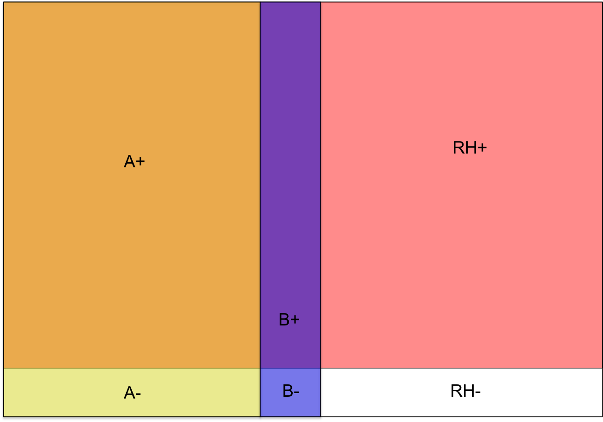

# Statistical Preliminaries 
<!--- glossary, up the spacing within paragraph --->

Briefly, this section contains a broad review of probability concepts and of statistical inference concepts, with examples from the forensic science context. We will cover probability, data collection, statistical distributions, estimation, and hypothesis testing. \vspace{-.25in}

### Definitions

- **population**: ______________________________________________________

\vspace{.1in}

- **sample**: _____________________________________________________

\vspace{.1in}

- **probability**: Using knowledge about the ________________ to make statements describing the __________________. Probability can be thought of as a type of deductive reasoning where we are applying general knowledge about the population of interest to draw conclusions about a small part of that population. 

\vspace{.1in}

- **statistics**: Using knowledge about the ________________ to make statements describing the __________________. Statistics can be thought of as a type of inductive reasoning where we are applying knowledge about a sample to state that something *may* be true about the population generally.

```{r thebigpic, echo=FALSE, out.width='.5\\linewidth', fig.align='center', fig.cap='"The Big Picture"', fig.pos="h"}

```

### Forensic Science Examples

- Suppose 100 1-pound bags of heroin are seized on the US-Mexico border, and the FBI want to know the chemical composition of the confiscated drugs to store in their database.\vspace{.1in}  
    * Population: __________________________
    \vspace{.1in}
    * Sample: __________________________
    \vspace{.1in}
- A window was broken in a robbery, and the suspect who was apprehended nearby had glass fragments lodged in the soles of their shoes. Do the fragments from the suspect's shoes have the same or similar chemical composition as the broken window? \vspace{.1in}  
    * Population 1: __________________________
    \vspace{.1in}
    * Sample 1: __________________________  
    \vspace{.1in}
    * Population 2: __________________________
    \vspace{.1in}
    * Sample 2: __________________________  
\vspace{.1in}
- A city government employee is suspected of embezzling funds from the city's coffers. Forensic accountants examine a subset of the city's transactions to determine whether embezzling occurred and how much money was lost. \vspace{.1in}  
    * Population: __________________________
    \vspace{.1in}
    * Sample: __________________________
    
How do you think this pertains to pattern evidence? List some possible relevant populations and samples below.\vspace{.1in}  

- Population 1: __________________________
    \vspace{.1in}
- Sample 1: __________________________  
    \vspace{.1in}
- Population 2: __________________________
    \vspace{.1in}
- Sample 2: __________________________ 
    \vspace{.1in}
- Population 3: __________________________
    \vspace{.1in}
- Sample 3: __________________________ 


## Probability

Probability concerns the *uncertainty* of outcomes. The set of all possible outcomes is called the ___________ space, and a particular outcome or set of outcomes of interest is referred to as an __________. 

### Examples 

1. Footwear 
    * Sample Space = All shoe sizes e.g. $\{6, 6.5, 7, 7.5, 8, 8.5, \dots\}$ 
    * Event = Shoe of size 9
2. Footwear
    * Sample Space = Brand of shoe e.g. \{ Nike, Vans, Converse, $\dots$\}
    * Event = Nike sneaker
3. Firearms
    * Sample Space = CMS (consecutive matching striae) for a pair of bullets e.g. $\{0, 1, 2, 3, 4, \dots \}$
    * Event = CMS of 10 or more 

### Interpretation

The probability of observing an event in a sample space is a number less than or equal to 1 and greater than or equal to 0 that describes the ____________ that the event will occur. 

There are two primary interpretations of probability: \vspace{.1in}

1. The long run ____________ of occurrence of an event. \vspace{.1in}
2. The _____________ belief of likelihood of an event occurring. 

### Basic Notation and Laws of Probability

Let an event of interest be denoted by _______. The probability of this event occurring is then denoted __________. Recall that the probability of an event is always between 0 and 1. When $P(Y) = 0$, the event $Y$ will never happen. When $P(Y) = 1$, the event $Y$ will always happen. The sum of the probabilities of all possbile outcomes in the sample space always equal to _____. 

The event of interest, $Y$, also has a complement event, $\overline{Y}$, which is read as "not $Y$". The complement, $\overline{Y}$, of an event, $Y$, is itself an event containing all outcomes in the sample space other than those that are part of the event $Y$. 

$$ P(Y) + P(\overline{Y}) = \_\_\_$$ 

The above equation also gives us the following rules: 

\begin{equation}\label{eq:1}
\begin{split}
P(Y) & = 1 - P(\overline{Y}) \\
 P(\overline{Y}) & = 1 - P(Y)
\end{split}
\end{equation}

### Probability and Odds

The probability of an event defines the odds of the event. The odds *in favor* of an event $Y$ are defined as the probability of $Y$ divided by the probability of everything except $Y$ ("not $Y$"): 

$$ O(Y) = \dfrac{P(Y)}{P(\overline{Y})} = \dfrac{P(Y)}{1-\_\_}.$$ 

Conversely, the odds *against* a event $Y$ are defined as the probability of everything except $Y$ ("not $Y$") divided by the probability of $Y$: 

$$ O(\overline{Y}) = \dfrac{P(\overline{Y})}{P(Y)} = \dfrac{1-\_\_}{P(Y)}.$$ 

When we typically talk about odds, like in horse racing, the odds reported are the odds *against* the outcome of interest. Let's construct a simple horse race scenario using our probability notation to find the probability of a horse winning a race from the reported odds: 

- Suppose you want to place a bet on a horse name Cleopatra winning the race. Odds for Cleopatra are reported as 4:1. 
- $Y$ = Cleopatra wins the race
- $\overline{Y}$ = Any horse in the race *other than* Cleopatra wins the race.
- $O(\overline{Y}) = \dfrac{P(\overline{Y})}{P(Y)} = \frac{4}{1} = 4$
- We know that $P(Y) + P(\overline{Y})=1$. With this information, we can determine $P(Y)$, which is the probability that Cleopatra wins the race: 
\begin{align*}
O(\overline{Y}) & = \dfrac{P(\overline{Y})}{P(Y)} = 4 \\
\Rightarrow  \dfrac{P(\overline{Y})}{P(Y)} & = 4 \\ \Rightarrow  \dfrac{1 - P(Y)}{P(Y)} & = 4 \quad \quad \textit{(See Equation \ref{eq:1})} \\ 
\Rightarrow \dfrac{1}{P(Y)} - 1 & = 4 \\
\Rightarrow \dfrac{1}{P(Y)} & = 5 \\
\Rightarrow P(Y) & = \frac{1}{5} = 0.2 \\
\Rightarrow P(\overline{Y}) & = 0.8
\end{align*}
- So, the odds for Cleopatra (4:1) mean that Cleopatra has a probability of 0.2 of winning the race. Because this outcome is not very likely (it will only happen in 1 race out of 5), you win money if Cleopatra wins simply because that is not a likely outcome. 
- **Betting**: Suppose you bet \$1 on Cleopatra to win the race with 4:1 odds. You will win \$4 if Cleopatra wins, otherwise you've lost \$1. 
- The amount you win (\$4) is determined so that you break even in the long run. 
- Suppose 5 identical races are run. In 1 of those races, Cleopatra will win, and in the other 4, Cleopatra will lose. If you bet \$1 on Cleopatra in each race, you will lose that \$1 4 of 5 times. So, in order for you to break even, the designated amount you'll win when Cleopatra wins is \$4.
- This is a statistical concept known as *expected value*. Your expected value when placing the bet is \$0. We compute expected value by multiplying each possible outcome value by its probability and adding them all together:
\begin{align*}
\$4\cdot P(Y) + (-\$1) \cdot P(\overline{Y}) & = 0 \\
\$4\cdot 0.2 + (-\$1) \cdot 0.8 & = 0 \\
\$0.8 - \$0.8 & = 0
\end{align*}
- **Note**: Odds and probabilities don't work exactly this way at the racetrack because odds are based on the amount of money bet and the track  takes a small fraction of each bet.   

### Probability Math

Up until now, we have only considered one event, $Y$. Now, suppose we have another event that we are interested in, $Z$. 

Let's consider the possibility of *either* of these two events, $Y$ or $Z$, occurring. We'd write this as $Y \cup Z$, which is mathematical notation for "$Y$ or $Z$ occurs". There are two scenarios that arise: \vspace{.1in}

1. $Y$ and $Z$ cannot occur together: they are _________ __________ \vspace{.1in}
2. $Y$ and $Z$ can occur together. 

In scenario \#1, computing the probability of either $Y$ or $Z$ happening is easy: we just add their respective probabilities together: 

$$ Y,Z \text{ mutually exclusive } \Rightarrow P(Y \cup Z) = P(Y) + P(Z)$$ 

In scenario \#2, computing the probability of either $Y$ or $Z$ happening is more complicated because we know there is a chance that $Y$ and $Z$ can happen together. We'd write this as $Y \cap Z$, which is mathematical notation for "$Y$ and $Z$ occurs". In scenario \#1, this event never occurred, so $P(Y \cap Z) = 0$ there. To compute the probability of $Y$ or $Z$ occurring in scenario \#2, we have to consider the probability of $Y$, the probability of $Z$, and the probability of $Y \cap Z$. If we just add $P(Y) + P(Z)$ as in scenario \#1, we include the event $Y \cap Z$ twice, so we have to subtract one instance of it: 

$$ Y,Z \text{ not mutually exclusive } \Rightarrow P(Y \cup Z) = P(Y) + P(Z) - P(Y \cap Z).$$ 

This probability is much easier to think about when illustrated. In Figure \ref{fig:bloodvendiag}, we consider human blood types. There are four groups: A, B, O, and AB, and there are two RH types: $+$ and $-$. We first consider the blood types A and B, represented by the two non-overlapping yellow and blue rectangles, respectively. Define: 

- Event $Y$ = a person has blood type A
- Event $Z$ = a person has blood type B
- Event $Y \cup Z$ = a person has blood type A or blood type B

These two events are *mutually exclusive* because one person cannot have both blood type A and blood type B. (The rectangles don't overlap in the figure.) So, the probability that a randomly selected person has blood type A or B is:

$$ P(Y \cup Z) = \_\_\_ \quad + \quad \_\_\_$$

```{r bloodvendiag, echo=FALSE, out.width='.5\\linewidth', fig.align='center', fig.cap='Probabilities of blood types in humans. Areas are approximate.', fig.pos="h"}

```

Return to Figure \ref{fig:bloodvendiag} and consider two other events: a person having blood type A or having the Rh factor (RH+). We see in Figure \ref{fig:bloodvendiag} that someone can have both type A blood and the Rh factor (blood type A+). Define: 

- Event $Y$ = a person has blood type A
- Event $Z$ = a person has the Rh factor 
- Event $Y \cup Z$ = a person has blood type A or the Rh factor
- Event $Y \cap Z$ = a person has blood type A and the Rh factor (they have A+ blood)

So, the probabilty that someone has either type A blood or has the Rh factor is the sum of probability of having type A blood (represented by the yellow rectangle) and the probability of having the Rh factor (represented by the red rectangle) minus the probability of having A+ blood (represented by the orange area of overlap that is counted twice) in Figure \ref{fig:bloodvendiag}. So, the probability that a randomly selected person has blood type A or the Rh factor is:

$$ P(Y \cup Z) = \_\_\_ \quad + \quad \_\_\_ \quad - \quad \_\_\_$$

### Conditional Probability

Let's consider an event of interest $Y$ which has probability $P(Y)$. Then, suppose we learn of another event of interest $Z$ that has occurred. Knowing that $Z$ has occurred already may change our opinion about the likelihood of _____ occurring. The key idea here is that the probability of an event often depends on other information, leading us to the definition of *conditional probability*: 

$$ P(Y|Z), $$
which is the conditional ______________ that $Y$ occurs given that we know $Z$ has occurred. Return to Figure \ref{fig:bloodvendiag}. Suppose we want to know the probability of a person having type A blood, represented by the yellow circle. But, if we already know that a person has the Rh factor, we are only interested in the part of the type A circle that overlaps with the Rh+ rectangle. Thus the probability of having type A blood is different with different knowledge. The formula for calculating conditional probability is:

\begin{equation}\label{eq:2}
P(Y|Z) = \frac{P(Y\cap Z)}{P(Z)}
\end{equation} 

Returning to the venn diagram, the value $P(Y \cap Z)$ is represented by the overlap of the type A circle and the Rh+ rectangle, and the value $P(Z)$ is represented by the Rh+ rectangle. Then, the value $P(Y|Z)$ is the ratio of the overlap (A+) to the Rh+ rectangle. 

Equation \ref{eq:2} also gives us a multiplication rule for computing probabilities: 

\begin{equation}\label{eq:3}
P(Y\cap Z) = P(Y|Z) \cdot P(Z)
\end{equation} 

Philosophically speaking, it can be helpful to think of *all* probabilities as conditional. It is just a question of what information is assumed to be ___________. 

#### Examples

**Death Penalty Convictions**

A study of sentencing of 362 black people convicted of murder in Georgia in the 1980s found that 59 were sentenced to death (@baldus). They also examined the race of the murder victim, either black or white, and found some disparities. In Table \ref{tab:dp}, DP means the defendant received the death penalty, NDP means the defendant did not receive the death penalty. The race of the victim (RV) is either black (B) or white (W). 

\begin{table}
\centering
\begin{tabular}{l|cc|r}
RV & DP & NDP & Total \\
\hline
W & 45 & 85 & 130 \\
B & 14 & 218 & 232 \\
\hline
Total & 59 & 303 & 362
\end{tabular}
\caption{\label{tab:dp}The results of the Baldus et al study for black defendants convicted of murder.}
\end{table}

Returning to Section \@ref(definitions), let's define the problem: 

- **Population**: All black people convicted of murder in Georgia in the 1980s
- **Sample**: N/A (the whole population was studied)

Using the numbers from Table \ref{tab:dp}, compute the following probabilities: 

- $P(DP) = \frac{\quad}{\quad} = 0.\_\_\_$ \vspace{.1in}
- $P(DP | RV = W) = \frac{\quad}{\quad} = 0.\_\_\_$ \vspace{.1in}
- $P(DP | RV = B) = \frac{\quad}{\quad} = 0.\_\_\_$ \vspace{.1in}

Note: These numbers are selected from the study, and should not be considered a comprehensive summary of its results. There are a number of things not discussed here. The entire publication can be found online^[http://scholarlycommons.law.northwestern.edu/cgi/viewcontent.cgi?article=6378&context=jclc.] 

**Consecutive Matching Striae**

In firearms and toolmark analysis, the number of consecutive matching striae (CMS) between a crime scene sample and a lab sample is often used to help assess whether the two samples have a common source. Generally speaking, the higher the maximum number of CMS found in a pair, the more likely the two samples came from the same source.  Several known match (KM) pairs and known non-match (KNM) pairs of bullets were examined, and the results are shown in Figure \ref{fig:cms} (@hare). What is the probability of seeing two known matches (or two known non-matches) given the maximum number of CMS? Here, we condition on __________________________. Again, we briefly return to Section \@ref(definitions), let's define the problem: 

- **Population**: All pairs of fired bullets from unknown sources
- **Sample**: A sample of pairs of known matches and known non-matches

```{r cms, echo=FALSE, fig.align='center', fig.pos="h", out.width='.6\\linewidth', fig.cap="This bar chart represents the conditional probabilities of two bullets matching given the maximum number of CMS. The light blue represents known matches, while the dark blue represents known non-matches."}
library(ggplot2)
bstats <- read.csv("dat/bullet-stats-old.csv")
bstats$cmstop <- bstats$CMS
#bstats$cmstop[bstats$CMS >=20] <- "20+"
bstats$cmstop <- factor(bstats$cmstop)
bstats$cmstop <- reorder(bstats$cmstop, bstats$CMS)
bstats$km <- c( "KNM", "KM")[as.numeric(bstats$match)+1]
bstats$km <- as.factor(bstats$km)
ggplot(data=subset(bstats, !flagged)) + 
  geom_bar(aes(x=cmstop, fill=km), position=position_fill(reverse = TRUE)) +
  theme(legend.position="bottom") + 
  scale_fill_brewer("", palette="Paired") +
  xlab("maximum CMS") + ylab("Proportion") +
  theme(text = element_text(size=12))  
```

Generally, as seen in Figure \ref{fig:cms}, the probability of finding a match tends to increase with then number of maximum CMS. For _____ maximum CMS values is it much more likely that we have a __________________ pair.

### Independence

If the likelihood of one event is *not* affected by knowing whether a second has occured, then the two events are said to be __________________. For example, the region of the country where you live and what color car you drive are (probably) not related. 

The death penalty example from the previous section demonstrates that defendants receiving the death penalty is *not* independent of the race of the victim. In other words, a black defendant found guilty of murder in Georgia in the 1980s received a different penalty depending on the race of the victim.

Another example from DNA analysis relies on on independence across chromosomes. By using loci on different chromosomes we insure that the observed alleles are independent, allowing for simple calculation of random match probabilities.  

### Probability Math...Again

Recall Equation \ref{eq:3}, which gives us the probability of two events, $Y$ and $Z$ occurring together: 

$$ P(Y \cap Z) = P(Z)\cdot P(Y|Z) = P(Y) \cdot P(Z|Y) $$

If $Y$ and $Z$ are *independent*, there is a simple formula: 

$$P(Y \cap Z) = \_\_\_\_ \cdot \_\_\_\_$$

This is because $Z$ occurring does not effect the probability of $Y$ occurring, and vice versa. Thus, 

$$ P(Y|Z) = P(Y) \quad \text{and} \quad P(Z|Y) = P(Z)$$

For example, the probability of being left-handed and from Florida is equal to the probability of being left-handed times the probability of being from Florida, assuming the events "being left-handed" and "being from Florida" are independent. 

Multiplying probabilities of events directly like this is *only* applicable when the events are independent. When *dependent* events are treated as independent events, things can go terribly wrong. An infamous example of this in the courts is the case \textit{People v. Collins}^[*People v. Collins*, 68 Cal.2d 319, 438 P.2d 33 (1968)]. This was a robbery trial, where eyewitnesses described the robbers as a "black male with a beard and a moustache, and a white female with a blonde ponytail, fleeing in a yellow car". 

The prosecution provided estimated probabilities of each of these individual characteristic: 

- P(black man with a beard) = ____________
- P(black man with a moustache) = ____________
- P(white woman with ponytail) = ____________
- P(white woman with blonde hair) = ____________
- P(yellow car) = ____________
- P(interratial couple in a car) = ____________

A mathematics "expert" talked about the so-called "multiplication rule for probability", and directly multiplied the above probabilities together without considering that the events could be *dependent*. i.e. a man with a beard probably has a much higher chance of having a moustache than a man with no beard. Due to this faulty math, the conviction was set aside and the statistical reasoning criticized for ignoring dependence among the characteristics. 

In a courtroom situation, let $S$ be the event that the suspect was present at the scene of the crime and $\overline{S}$ be the event that the suspect was not present at the scene. Assume that each juror has in mind an initial probability for the events $S$ and $\overline{S}$. Then, a witness says they saw a tall Caucasian male running from the scene, and the defendant is a tall Caucasian male. After hearing the witness' testimony, the jurors _________ their probabilities. Next, an expert witness testifies that fragments from a window broken during the crime and fragments found on the defendant's clothing match.  Again, the jurors update their ____________.  This process continues throughout the trial. There are some key questions to consider: 

- How should jurors update their probabilities?
- Do jurors *actually* think this way?

### Bayes' Rule

*Bayes' Rule* provides an _________ formula for probabilities. Like in the trial scenario above, suppose we have an initial estimate for the probability of event $S$, $P(S)$. Then, we learn that an event $R$ has occurred and we want to update or probability of event $S$. To do this, we need to know about the ____________ of $R$ and $S$. To update the probability of $S$, we can use Bayes' Rule, also called Bayes' ___________:

\begin{equation}\label{eq:4}
\begin{split}
P(S|R) & = \frac{P(R \cap S)}{P(R)} = \frac{P(R|S)P(S)}{P(R)} \\
& = \frac{P(R|S)P(S)}{P(R|S)P(S) + P(R|\overline{S})P(\overline{S})} 
\end{split}
\end{equation}

```{r probtree, echo = FALSE, fig.align='center', fig.cap="A probability tree showing the direction of flow when updating probabilities. Move from left to right on the tree through the events possible. Events are in boxes, probabilities are on the branches of the tree.", out.width='.7\\linewidth'}
dat <- data.frame(id = c("", "S", "not S", "R", "not R", "R", "not R"),
                  x = c(0,1,1,2,2,2,2), 
                  y = c(0,1,-1,1.5,.5,-.5,-1.5), 
                  stringsAsFactors = FALSE)
edges <- data.frame(from = c("","", "S", "S", "not S", "not S"), 
                    to = c("R", "not S", "R", "not R", "R", "not R"),
                    from.x = c(0,0,1,1,1,1),
                    from.y = rep(c(0,1,-1), each = 2),
                    to.x = c(1,1,2,2,2,2), 
                    to.y = c(1,-1,1.5,.5, -.5, -1.5),
                    stringsAsFactors = FALSE)

labs <- data.frame(x = c(.5, 1.5, 1.5, .5, 1.5, 1.5),
                   y = c(.5, 1.25, .5, -.75, -.75, -1.5),
                   lab = c("P(S)", "P(R | S)", "P(not R | S)", "P(not S)", "P(R | not S)", "P(not R | not S)"),
                    stringsAsFactors = FALSE)

ggplot() + 
  geom_segment(data = edges, aes(x = from.x, y = from.y, xend = to.x, yend = to.y)) + 
  geom_label(data = dat, aes(x=x, y=y, label=id)) + 
  geom_text(data = labs, aes(x=x, y=y, label = lab), vjust = -1) + 
  theme_void()
```

#### Examples 

Consider performing diagnostic tests for gunshot residue. 

- Let $G$ denote the presence of gunshot residue \vspace{.1in}
- Let $\overline{G}$ denote the ____________ of gunshot residue \vspace{.1in} 
- Let $T$ denote a _____________ diagnostic test \vspace{.1in}
- Let $\overline{T}$ denote a negative diagnostic test

\begin{table}[h]
\centering
\begin{tabular}{|l|c|c|}
\hline
Truth & $T$ & $\overline{T}$ \\
\hline
$G$ & True Positive & False Negative \\
\hline
$\overline{G}$ & False Positive & True Negative \\
\hline
\end{tabular}
\caption{\label{tab:bayesex} All potential outcomes of a diagnostic test for gunshot residue.}
\end{table}

The values in the table can also be thought of as conditional probabilities: 

- The value $P(T|G)$ is the _______________________ rate, also called *sensitivity* of the test \vspace{.1in}
- The value $P(\overline{T}|\overline{G})$ is the ____________________ rate, also called the *specificity* of the test \vspace{.1in}
- The value $P(T|\overline{G})$ is the ______________________ rate, the Type I error rate \vspace{.1in} 
- The value $P(\overline{T}|G)$ is the ________________________ rate, the Type II error rate 

Studies of the diagnostics test usually tell us $P(T|G)$,  ___________,  and $P(\overline{T}|\overline{G})$, __________ . Examiners may begin with some idea of $P(G)$, or the ___________ of gunshot residue in a similar situation. What is most relevent for the case is the *postitive predictive value*, or in probability notation, ___________. We can use __________________________ to obtain this value: 

$$ P(G|T) = \frac{P(T|G)P(G)}{P(T|G)P(G) + P(T|\overline{G})P(\overline{G})}$$

Generally speaking, the most important thing to remember is that, in general, $P(T|G) \quad \_\_\_\_ \quad P(G|T)$. 

The careful application of Bayes' Rule can sometimes lead to surprising, non-intuitive results. Continuing with the gunshot residue test example, assume 

- sensitivity is 98% ($P(\quad|\quad) = 0.98$) \vspace{.1in}
- specificity is 96% ($P(\quad|\quad) = 0.96$) \vspace{.1in}
- prevalence is 90% ($P(\quad) = 0.90$) \vspace{.1in}
- Plug values into the Bayes' Rule formula to find $P(G|T)$:
\begin{equation}\label{eq:5}
\begin{split}
 P(G|T) & = \frac{P(T|G)P(G)}{P(T|G)P(G) + P(T|\overline{G})P(\overline{G})} \\ 
 & = \frac{0.98 \cdot 0.9}{0.98 \cdot 0.9 + (1- 0.96)\cdot (1-0.9)} \\ 
 & = \frac{0.882}{0.882 + 0.004} \\
 & = 0.995
\end{split}
\end{equation}
- Now assume prevalence is 10% ($P(\quad) = 0.10$) and plug in the values again \vspace{.1in}
\begin{equation}\label{eq:6}
\begin{split}
 P(G|T) & = \frac{P(T|G)P(G)}{P(T|G)P(G) + P(T|\overline{G})P(\overline{G})} \\ 
 & = \frac{0.98 \cdot 0.1}{0.98 \cdot 0.1 + (1- 0.96)\cdot (1-0.1)} \\ 
 & = \frac{0.098}{0.098 + 0.036} \\
 & = \frac{0.098}{0.134} \\
 & = 0.731
\end{split}
\end{equation}
- So, even if there is a postive test, we are not really sure about whether gunshot residue is *actually* present.
- Why does this happen?? See Figure \ref{fig:probtree2}.

```{r probtree2, echo = FALSE, fig.align='center', fig.pos="h", fig.cap="A probability tree showing the direction of flow when updating probabilities for the presence of gunshot residue. Suppose there are 1,000 people in the population you're considering. Write the number of people in the groups throughout the tree according to the probabilities indicated on the branches of the tree", out.width='.7\\linewidth'}
dat <- data.frame(id = c("1000\npeople", "G", "not G", "T", "not T", "T", "not T"),
                  x = c(0,1,1,2,2,2,2), 
                  y = c(0,1,-1,1.5,.5,-.5,-1.5), 
                  stringsAsFactors = FALSE)
edges <- data.frame(from = c("1000\npeople","1000\npeople", "G", "G", "not G", "not G"), 
                    to = c("T", "not T", "T", "not T", "T", "not T"),
                    from.x = c(0,0,1,1,1,1),
                    from.y = rep(c(0,1,-1), each = 2),
                    to.x = c(1,1,2,2,2,2), 
                    to.y = c(1,-1,1.5,.5, -.5, -1.5),
                    stringsAsFactors = FALSE)

labs <- data.frame(x = c(.5, 1.5, 1.5, .5, 1.5, 1.5),
                   y = c(.5, 1.25, .5, -.75, -.75, -1.5),
                   lab = c("0.10", "0.98", "0.02", "0.90", "0.04", "0.96"),
                    stringsAsFactors = FALSE)

ggplot() + 
  geom_segment(data = edges, aes(x = from.x, y = from.y, xend = to.x, yend = to.y)) + 
  geom_label(data = dat, aes(x=x, y=y, label=id)) + 
  geom_text(data = labs, aes(x=x, y=y, label = lab), vjust = -1) + 
  xlim(c(-.1, 2.1)) + 
  theme_void()
```

### Bayes' Rule to the Likelihood Ratio

In the general forensic setting, let $S$ denote the event that the evidence from the scene and comparison sample are from the same source. Let $E$ denote the all of the evidence, both the crime scence sample and the comparison sample from the suspect. The formulation of Bayes' Rule for this situation is: 

$$ P(S|E) = \frac{P(E|S)P(S)}{P(E|S)P(S) + P(E|\overline{S})P(\overline{S})}$$

We can rewrite Bayes' Rule in terms of odds: 

\begin{equation}\label{eq:odds}
\frac{P(S|E)}{P(\overline{S}|E)} = \frac{P(E|S)}{P(E|\overline{S})}\frac{P(S)}{P(\overline{S})}
\end{equation}

Derivation of Equation \ref{eq:odds} is shown in Equation \ref{eq:7}. For now, just consider Equation \ref{eq:odds}: 

- On the left, $\frac{P(S|E)}{P(\overline{S}|E)}$ are the odds in favor of $S$ given the evidence $E$. 
- The last term on the right, $\frac{P(S)}{P(\overline{S})}$ are the odds in favor of $S$ before seeing the evidence $E$ (the "prior odds") \vspace{.1in}
- The first term on the right $\frac{P(E|S)}{P(E|\overline{S})}$, is known as the _____________ ratio \vspace{.1in}
- The likelihood ratio (LR) is the factor by which we ___________ prior odds of two samples being from the same source to get ______________ odds (after seeing evidence) of the same source. 

\begin{equation}\label{eq:7}
\begin{split}
P(S|E) & = \frac{P(E|S)P(S)}{P(E|S)P(S) + P(E|\overline{S})P(\overline{S})} \\
\Rightarrow \frac{1}{P(S|E)} & = \frac{P(E|S)P(S) + P(E|\overline{S})P(\overline{S})}{P(E|S)P(S)} \\ 
  & = 1 + \frac{P(E|\overline{S})P(\overline{S})}{P(E|S)P(S)} \\ 
\Rightarrow \frac{1}{P(S|E)} -1 & = \frac{P(E|\overline{S})P(\overline{S})}{P(E|S)P(S)} \\ 
\frac{1}{P(S|E)} - \frac{P(S|E)}{P(S|E)} & = \\
\frac{1-P(S|E)}{P(S|E)} & = \\
\frac{P(\overline{S}|E)}{P(S|E)} & =  \frac{P(E|\overline{S})P(\overline{S})}{P(E|S)P(S)} \\
\Rightarrow \frac{P(S|E)}{P(\overline{S}|E)} & = \frac{P(E|S)P(S)}{P(E|\overline{S})P(\overline{S})} 
\end{split}
\end{equation}

#### Examples

Return to the gunshot residue (GSR) test example. Define:

- $E$ = evidence = a positive test for (GSR)
- $S$ = suspect has GSR on them 

$$LR = \frac{P(E|S)}{P(E|\overline{S})} = \frac{0.98}{0.04} = 24.5$$

In a high prevalence case ($P(G)=0.9$), the prior odds are $\frac{0.9}{0.1} = 9$. The posterior odds are $LR \times$prior odds $= 24.5\times 9 = 220.5:1$.

In a low prevalence case ($P(G)=0.1$), the prior odds are $\frac{0.1}{0.9} = \frac{1}{9}$. The posterior odds are $LR \times$prior odds $= 24.5\times \frac{1}{9} = 24.5:9 = 2.72:1$. 

We can also compute the likelihood ratio if the evidence were a negative test. This value turns out to be $\frac{1}{48}$, which is **not** the reciprocal of the LR for the positive test.

### Recap

- Probability is the _____________ language of _____________ \vspace{.1in}
- Provides a common scale, from _____ to _____, for describing the chance that an event will occur \vspace{.1in}
- **Conditional** probability is a key concept! The probabilitity of an event depends on what ____________ is available \vspace{.1in}
- Independent events can be powerful! They allow us to _________ probabilities of events *directly*, as is common in _________________. \vspace{.1in}
- ____________________ is a mathematical result showing how we should ___________ our probabilities when available information changes. \vspace{.1in}
    * This will later lead us to the likelihood ratio as a numerical ____________ of the evidence. \vspace{.1in}
    * Bayes' Rule does not necessarily describe how people operate in practice.
    
### Probability and the Courts

Sally Clark was the only person in the house when her first child died unexpectedly at 3 months old. The cause of death was determined to be SIDS, sudden infant death syndrome. One year later, Sally and her husband had a second child, who died at 2 months old under similar circumstances.  Sally was convicted of murder. 

During her trial, a pediatrician testified that the probability of a single SIDS death for a family like the Clarks (similar income, etc.) was $\frac{1}{8500}\approx 0.0001$, and thus the probability of two SIDS death in the family was $\frac{1}{8500^2} = \frac{1}{73 \times 10^6} \approx 1.37 \times 10^{-8}$. There are several problems with this approach to evidence. What do you think? Jot down a few ideas below: 
\vspace{.1in}

\rule{\textwidth}{.4pt} 

\vspace{.1in}

\rule{\textwidth}{.4pt} 

\vspace{.1in}

\rule{\textwidth}{.4pt} 

\vspace{.1in} 

Issues with the evidence presented by the pediatrician: 

1. Is the probability of a child dying of SIDS given, $\frac{1}{8500}$, correct for "families like the Clarks"? (The usual incidence at the time was $\frac{1}{1300}$. The pediatrician took account of several characteristics of the Clarks that lowered the probability but ignored others that would raise the probability.)
2. The use of direct multiplication of probabilities assumes independence of the two deaths in the family. (Independence within the family is not a reasonable assumption.)
3. Alternative hypotheses (causes of death of the infants) and their likelihood were not considered. (How likely is it for there to be a 
double homicide in "families like the Clarks"?) 

## Probability to Statistical Inference

Probability is important, but it is only one tool in our toolbox. Another, more powerful tool is statistical inference.

### Collecting Data

First, we consider data collection. Where do data come from? One data source is an *experiment*. An investigator designs a study and collects information on and maybe applies treatments to a *sample*, a subset of the population of interest. _________ can tell us a great deal about how to design an ___________ or choose a _________. 

The area of statistics concerned with creating studies is called *experimental design*. The experimental design literature is extensive (see for example @doe). Here are a few crucial points: 

- The goal of an experiment is to compare ____________ \vspace{.1in}
- Those ____________ must be ___________ assigned to units \vspace{.1in}
- The ______________ in the experiment must be large enough to be able to make informed conclusions
- Blinding plays an important role in avoiding _______. e.g. "double-blind" studies in medicine, where neither the patient nor the doctor administering the treatment know which treatment the patient is receiving

How is experimental design relevant to forensic science? 

- Experiments are used to evaluate process improvements
- Blinding is used in "black box" studies, where examiners do not know ground truth 

Experiments almost always involve *sampling* from the population of interest. Why? 

- We sample because it is too _________ or _____________ to study the *entire* population \vspace{.1in}
- A _________ sample allows us to use the laws of ___________ to describe how certain we are that our ____________ answer reflects the ____________.
- There are many famous failures (cautionary tales) with __________________ sampling. (See Figure \ref{fig:dewey}.)

How is sampling relevant to forensic science? 

- Sampling techniques used to determine which and how many bags of suspect powder collected from a crime scene to test.

```{r dewey, echo=FALSE, out.width='.5\\linewidth', fig.align='center', fig.cap='This picture from the US presidential election of 1948 shows President Harry Truman, who won the election, holding a newspaper that went to print with the headline "Dewey Defeats Truman!" The headline was based on biased sampling that favored typically Republican demographics. Image Source: https://blogs.loc.gov/loc/2012/11/stop-the-presses/', fig.pos="h"}

```

All data collected can be divided into one of two groups: qualitative or quantitative. 

- **Qualitative** data describe qualities about the observations. For example, the race of a suspect, or their level of education. There are two subcategories of qualitative data: \vspace{.1in}
    * ______________: the data belong to one of a discrete number of groups or categories. For example: blood type (A, B, AB, or O) \vspace{.1in}
    * ______________: the data belong to one group in a set of ordered values. For example, the evaluation of a teacher (poor, average, excellent). The categories have an inherent ordering, unlike in categorical data.\vspace{.1in}
- **Quantitative** data describe quantities that can be measured on the observations. These are numerical data. There are also two subcategories of quantitative data: \vspace{.1in}
    * _______________: the values are distinct or separate. An easy-to-understand example is integer observations: $\{0,1,2,3,4, \dots \}$. A forensic science example is consecutive matching striae on bullets or toolmarks. (See Figure \ref{fig:cms})
    * ________________: the values can take on any value in a finite or infinite interval. Continuous values fall anywhere on the number line. A forensic science example is the refractive index of a glass fragment.

### Probability Distributions

Suppose we are to collect data on some characteristic for a sample of individuals or objects (e.g. weight, trace element concentration). A probability ___________ is used to describe these possible values and how ___________ each value is to occur. There are many, many possible probability distributions, but some of the most common are the Binomial, Poisson, Normal, and Lognormal distributions. The probabilities associated with each of these distributions and their possible outcomes are plotted in Figures \ref{fig:binompois}-\ref{fig:normlnorm}.

- Discrete distributions \vspace{.1in}
    * _________________: counts the number of __________ in a fixed number ($n$) of ___________. Possible values are $\{0,1,2, \dots, n\}$. \vspace{.1in}
    * ______________: counts the number of __________ occurring. Possible values are $\{0,1,2,3,4,5,\dots\}$
    
```{r binompois, echo=FALSE, message = FALSE, fig.align='center', fig.pos='h', fig.cap='On the left, the probability of each possible outcome for variable with binomial distribution with 10 trials and probability of success 0.75. On the right, the probability of each possible outcome for variable with Poisson distribution with mean value 5.', out.width='.49\\linewidth', fig.show='hold'}
library(ggfortify)
Binom <- data.frame(x = 0:10,
                    y = dbinom(0:10, 10, .75))
Pois <- data.frame(x = 0:20,
                    y = dpois(0:20, 5))
ggplot(data= Binom) + 
  geom_bar(aes(x = x, weight = y)) + 
  scale_x_continuous(labels = 0:10, breaks = 0:10)  +
  labs(x = "Number of successes", y = "Probability", 
       title = "Binomial(10,0.75)") + 
  theme_minimal()
ggplot(data= Pois) + 
  geom_bar(aes(x = x, weight = y)) + 
  scale_x_continuous(labels = 0:20, breaks = 0:20)  +
  labs(x = "Number of events observed", y = "Probability", 
       title = "Poisson(5)") + 
  theme_minimal()
```

- Continuous distributions \vspace{.1in}    
    * _______________: the famous, symmetric "bell-shaped" _________. Possible values are all real numbers, $(-\infty, \infty)$ 
    * ______________: the (natural) logarithm of observations from this distribution follow a __________ distribution. Possible values are all positive real numbers, $(0,\infty)$ 
    
```{r normlnorm, echo=FALSE, message=FALSE, fig.align='center', fig.pos='h', fig.cap="On the left, the probability distribution curve of possible outcomes for a variable with Normal distribution with mean value 100 and standard deviation 15. On the right, the probability distribution curve of possible outcomes for a variable with Lognormal distribution with mean value 0 and standard deviation 1.", out.width='.49\\linewidth', fig.show='hold'}
ggdistribution(dnorm, seq(55, 145, 1), mean = 100, sd = 15) + 
  scale_x_continuous(breaks = seq(60,140,20), 
                     labels = seq(60,140,20)) + 
  theme_minimal() + 
  labs(x = "", y = "Density", title = "Normal(100,15)")

ggdistribution(dlnorm, seq(0,10,.05), meanlog = 0, sdlog = 1) +
  scale_x_continuous(breaks = seq(0,10,2), 
                     labels = seq(0,10,2)) + 
  theme_minimal() + 
  labs(x = "", y = "Density", title = "LogNormal(0,1)")
```

#### Normal

You may already be familiar with this distribution with the bell-shaped curve. Measurement error is one example of something often assumed to follow a normal distribution. The normal distribution is described by two parameters: the ________, denoted by $\mu$, and the ____________________, denoted by $\sigma$. If we have a variable (say, something observed in our data like weight), we give the variable a capital letter, typically $X$. If this variable $X$ is normally distributed with mean $\mu$ and standard deviation $\sigma$, we write this as:  

$$ X \sim N(\_\_\_, \_\_\_) $$

In measurement error, for example, we typically assume that the mean is 0. So, if $X$ represents measurement error, we'd write $X \sim N(0,\sigma)$. 

There are many nice properties of the normal distribution. For instance, we know that _____% of observable values lie within _____ standard deviations of the mean ($\mu \pm 2\sigma$), and also that _____% of observable values lie within _____ standard deviations of the mean ($\mu \pm 3\sigma$). When working with the normal distribution, we use software (such as Excel, Matlab, R, SAS, etc.), tables^[See for example http://www.stat.ufl.edu/~athienit/Tables/Ztable.pdf], or websites like [onlinestatbook.com](http://onlinestatbook.com/2/calculators/normal_dist.html) or  [stattrek.com](http://stattrek.com/online-calculator/normal.aspx) to compute probabilities of events. 

```{r norm4, echo=FALSE, message=FALSE, fig.align='center', fig.pos='h', fig.cap='Four examples of the probability distribution functions for normally distributed variables', out.width='.49\\linewidth', fig.show='hold'}
ggdistribution(dnorm, seq(55, 145, 1), mean = 100, sd = 15) + 
  scale_x_continuous(breaks = seq(60,140,20), 
                     labels = seq(60,140,20)) + 
  scale_y_continuous(breaks = seq(0,.02, .01), labels = seq(0,.02, .01)) + 
  theme_minimal() + 
  labs(x = "IQ", y = "Density", 
       title = "IQ Scores are approximately Normal(100,15)")
ggdistribution(dnorm, seq(58, 82, .25), mean = 69, sd = 3) + 
  scale_x_continuous(breaks = seq(60,80,5), 
                     labels = seq(60,80,5)) + 
  scale_y_continuous(breaks = seq(0,.12, .04), labels = seq(0,.12, .04)) +  
  theme_minimal() + 
  labs(x = "Height (in)", y = "Density", 
       title = "Men's Heights (in) are approximately Normal(69,3)") 
ggdistribution(dnorm, seq(1.5198, 1.5202, .000005), mean = 1.52, sd = .00005) + 
  scale_x_continuous(breaks = seq(1.5198, 1.5202,.0001), 
                     labels = seq(1.5198, 1.5202,.0001)) + 
  scale_y_continuous(breaks = seq(0,8000, 2000), labels = seq(0,8000, 2000)) + 
  theme_minimal() + 
  labs(x = "Glass RI", y = "Density", 
       title = "Glass Refractive Index (RI) approximately Normal(1.52,0.00005)")
ggdistribution(dnorm, seq(-4, 4, .05), mean = 0, sd = 1) +
  scale_x_continuous(breaks = seq(-4,4,2), 
                     labels = seq(-4,4,2)) + 
  scale_y_continuous(breaks = seq(0,.4, .1), labels = seq(0,.4, .1)) +  
  theme_minimal() + 
  labs(x = "x", y = "Density", 
       title = "Standard Normal(0,1)") 
```

#### Lognormal

We often act as if everything is normally distributed, but of course this is not true. For instance, a quantity that is certain to be ___________ (greater than or equal to zero) cannot possible be normally distributed. Consider trace element concetration: either none is detected, or there is some amount greater than 0 detected. 

In cases where nonnegative values are not possible, we may believe that the (natural) _________ of the quantity is normal, which gives us a __________ distribution for the quantity itself. The lognormal distribution, like the normal, has two parameters: mean (on the log scale), denoted _____, and standard deviation (on the log scale), denoted _____. 

```{r lognorm, echo = FALSE, message=FALSE, fig.align='center', fig.pos='h', fig.cap='Three lognormal distributions with the same mean (on the log scale) and different standard deviations (on the log scale)', out.width='.5\\linewidth'}
x <- seq(0, 3, .005)
sln <- dlnorm(x, meanlog=0, sdlog=1)
ln05 <- dlnorm(x, meanlog=0, sdlog=.5)
ln025 <- dlnorm(x, meanlog=0, sdlog=.25)
dat <- data.frame(x,sln,ln05,ln025)
library(tidyr)
dat %>% gather(dist, val, -x) %>% 
  ggplot() + geom_line(aes(x = x , y = val, color = dist)) + 
  theme_minimal() + 
  scale_color_discrete(labels = c("Lognormal(0,0.25)", "Lognormal(0,0.5)", "Lognormal(0,1)"), name = "") + 
  theme(legend.position = c(.75,.75), legend.background  = element_rect(fill = 'white', color = 'white'))
```

#### Discrete 

Some quantities take on very few possible values. These are *discrete* data. 

Recall the two common discrete distributions from section \@ref(probability-distributions): 

- Binomial: \vspace{.1in}
    * Data are ________ (two categories: "success" or "failure") \vspace{.1in}
    * Data are a result of $n$ independent _________  \vspace{.1in}
    * $P(\text{success}) = p$ on each trial. (Same _________ of success each time)  \vspace{.1in}
    * Expected number of successes you expect to see out of $n$ trials: _____ $\times$ _____  \vspace{.1in}
    * Example: Suspect a student of cheating on an exam, response is the number of correct answers.
- Poisson: \vspace{.1in}    
    * Data are counts: number of events occurring in a _________ time \vspace{.1in}
    * The mean and the ____________ of this distribution are the same, so the variablility in responses increases as the _________ increases. \vspace{.1in}
    * Example: number of calls to 911 between 10:00 and midnight on Friday nights. See Figure \ref{fig:cmspois} for a forensics example. 
    
```{r cmspois, echo=FALSE, message=FALSE, warning=FALSE, fig.align='center', fig.cap='Distribution of the maximum number of CMS for a randomly selected bullet compared to 118 known lands approximately follows a Poisson distribution.', fig.pos='h', out.width='.5\\linewidth'}
library(dplyr)
bstats %>% filter(b2 == "Ukn Bullet C-3") %>% 
  ggplot() + 
  geom_bar(aes(x = CMS)) + 
  theme_minimal() + 
  labs(x = "Number of CMS", y = "Count")
```

## Statistical Inference - Estimation

Recall from Section \@ref(definitions): 

- The _____________ is the universe of objects of interest. \vspace{.1in}
- The _____________ is comprised of the objects available for study. \vspace{.1in}
- _____________ is deductive: use knowledge about the population to make statements describing the sample  \vspace{.1in}
- _____________ is inductive: use knowledge about the sample to make statements describing the population \vspace{.1in}
- Probability and statistics are used together!  \vspace{.1in}
    1. Build or assume a ________ for a population   \vspace{.1in}
    2. Assess the _________ using the model  \vspace{.1in}
    3. Refine the model, return to step 2. 

### Background

A ____________ is a numerical characteristic of the population, e.g. the population mean. Statistical methods are usually concerned with learning about population parameters from _____________________. 

Note: The mean of a *sample* and the mean of a *population* are differenct concepts. The mean of a sample can be calculated exactly, while the mean of a population is (usually) unknown, because there are too many objects in the population to record and calculate the mean. 

The idea underlying statistical inference is that we can apply laws of probability to draw __________ about a population from a sample. This process is briefly summarized below: 

- Observe _________ mean \vspace{.1in}
- If we have a "good" sample this sample mean should be close to the ___________ mean.  \vspace{.1in}
- The laws of ____________ tell us how close we can expect them to be. 

For example, suppose we are interested in the average height of the adult population in the U.S.

- Population: _______________  \vspace{.1in}
- Sample: _______________  \vspace{.1in}
- We can take the average height of everyone here and use this sample ___________ to make ___________ about the ____________ mean of all U.S. adults.
- Note: This approach will work if our sample is a _________ sample from the population. This assumption may be questionable, so it should be verified. 

The *goal* of statistical inference is ____________ about a ______________. Different possible parameters are:  \vspace{.1in}

- Mean
- Variance
- Proportion

We can also make different types of inferential statements, depending on what question we are trying to answer and how we are going to report our results. We will talk about:

- ____________ estimate: an estimate of a parameter value \vspace{.1in}
- ____________ estimate: a range of plausible values for a parameter \vspace{.1in}
- Hypothesis ____________: examine a specific hypothesis about the true value of a parameter

When you want to do statistical inference, it is always inportant to look at your sample data before proceeding directly to inference. We do this because we want to

1. See general _____________ in the data  \vspace{.1in}
2. Get an idea of the ___________ of the distribution of the data  \vspace{.1in}
3. Identify ____________ values and/or errors. 

How do we look at our data to check for these three things? If our data are _____________, we look at a table of frequencies or a bar chart of the different outcomes. If our data are ____________, we look at histograms of the values, or numerical summaries such as mean, median, standard deviation, or percentiles. 

A quick example shows why it can be important to examine your data before a formal statistical analysis: 

- Suppose the data are (19,20,21,22,23). Then, the mean is $\frac{19+20+21+22+23}{5} = 21$, the median is 21, and the standard deviation is 1.58. 
- But what if the data you receive are (19,20,21,22,93)? Then, the mean is $\frac{19+20+21+22+93}{5} = 35$, the median is 21, and the standard deviation is 32.4. 
- There could have been a typo, or someone interpreted some handwriting wrong, etc. The moral of the story is ALWAYS look at your data first! 

### Point Estimation

An __________ is a rule for estimating a population __________ from a sample. We evaluate the quality of the estimator by considering two key properties: 

- Bias: how close ________________ an estimator is to the true population mean \vspace{.1in}
- Variability: how __________ is the estimate?

For the population mean, we might use the sample mean as an estimator because it has _____ bias and ________ variability if the sample is _________. There are other possible estimators for the mean such as:

- The median (good for skewed data or data with outliers)
- The midrange ($\frac{\max + \min}{2}$)
- 47 (obviously this is just guessing and is not advised)

Let $\theta$ denote an unknown population parameter that we wish to estimate. The letter $\theta$ represents the true value of the parameter. In Figure \ref{fig:theta1}, we see what would happen in many repeated attempts to estimate $\theta$ using estimators with different properties. 

```{r theta1, echo=FALSE, message=FALSE, warning=FALSE, fig.align='center', fig.cap='The curve in each plot shows the distribution of estimates we would see under each condition shown.', fig.pos='h', out.width='.99\\linewidth'}
theta <- 0
x <- seq(-7, 7, .1)
lblv <- dnorm(x, 0, .5)
lbhv <- dnorm(x, 0, 2)
hblv <- dnorm(x, 2, .5)
hbhv <- dnorm(x, 2, 2)
dat <- data_frame(x=x, "low bias/low variance" = lblv,
                  "low bias/high variance" = lbhv, 
                  "high bias/low variance" = hblv, 
                  "high bias/high variance" = hbhv)
dat %>% gather(type, value, -x) -> dat2
dat2$type <- factor(dat2$type, c(unique(dat2$type)), ordered=T)
  ggplot(data = dat2) + geom_line(aes(x = x, y = value)) + 
  geom_vline(xintercept = theta) + 
  scale_x_continuous(breaks = 0, label = expression(theta)) + 
  labs(x = "Estimate values", y = "Density") + 
  theme_minimal() +   
  facet_wrap(~type, scales = 'free')
```

### Standard Errors

One limitation of just providing a point estimate is that it doesn't give us any indication of _____________. As we saw in Figure \ref{fig:theta1}, a point estimate alone can be very different from the true mean. We can do better than this! 

The ___________________________ of an estimator measures the uncertainty in our estimate. When looking at a summary statistic, like mean, median, or percentiles, that statistic is also a _________________ quantity. This means that if we had observed a different set of sample values, we would observe different values of the summary statistics. The idea of standard error is similar to the idea of standard deviation. Both are measures of spread, or variability. The difference is that standard deviation is a measure of variability of a sample or population, while standard error is a measure of variability of an _______________. 

Consider a population that is normally distributed with mean 100 and standard deviation 15. Recall from Section \@ref(normal) that 95% of observations from a normal distribution fall within two standard deviations of the mean. So, in this example we expect 95% of observations to be between 70 and 130. This distribution is shown on the left in Figure \ref{fig:sampdist}. Now suppose we want to look at the distribution of the *estimates* of the population mean from several samples. This will demonstrate the idea of a standard error, using a sample size of $n=25$. The formula to compute the standard error is: 

$$se = \frac{}{\sqrt{\quad}}$$

The standard error for this example is $\frac{15}{\sqrt{25}} = 3$. The mean of a sample of size 25 from this population should be about ________. And about 95% of the time, the sample mean will be between _____ and _____. This distribution is shown on the right in Figure \ref{fig:sampdist}.

```{r sampdist, echo=FALSE, message=FALSE, warning=FALSE, fig.align='center', fig.cap='On the left, the distribution of the population, which is distributed N(100,15). On the right, the distribution of the sample mean for samples of size 25 from the populations, which is distributed N(100,3).', fig.pos='h', out.width='.99\\linewidth', out.height='3in'}
x <- seq(55,145,.5)
samp <- dnorm(x, 100,15)
repsamp <- dnorm(x, 100,3)
dat <- data_frame(x = x, samp, repsamp)
dat %>% gather(dist, value, -x) -> dat2 
dat2$dist <- factor(dat2$dist, levels = unique(dat2$dist), labels = c("Distribution of the population", "Distribution of mean of 25 observations"))  
ggplot(dat2) + geom_line(aes(x = x, y =value)) + 
  scale_x_continuous(breaks = seq(60,140,20), labels = seq(60,140,20)) + 
  facet_wrap(~dist, scales = 'free') +
  theme_minimal()
```

### Sample Size

The size of a sample plays a *critical* role in determining how accurate we can be. Again, consider a population with distribution $N(100,15)$. We can use __________ to examine the effect of sample size. We simulate samples from a normal distribution with mean 100 and standard deviation 15. We use four different sample sizes: 10, 25, 50, and 100. We take 500 samples of each size and compute the mean for each sample, leaving us with 2,000 means that we have calculated. We show histograms of the means of these samples for each sample size in Figure \ref{fig:sims}. 

```{r sims, echo = FALSE, message=FALSE, warning=FALSE, fig.align='center', fig.cap='How does sample size affect the sampling distribution? As sample size increases, the standard error decreases, so the distribution of sample means becomes more narrow.', fig.pos='h', out.width='.99\\linewidth'}
mu <- 100
sig <- 15
n <- c(10, 25, 50, 100)
M <- 500
library(purrr)
mysims <- data_frame(group= 1:4,mu = mu, sig = sig, n = n, M = M) %>% nest(-group)
mysimfun <- function(dat){
  mat <- matrix(0, nrow = dat$M, ncol = dat$n)
  for(i in 1:M){
    mat[i, ] <- rnorm(dat$n, mean = dat$mu, sd = dat$sig)
  }
  mat <- data.frame(mat)
  mat$m <- 1:M
  return(mat)
}
mysims %>% mutate(sims = map(data, mysimfun)) %>%
  unnest(data) %>% unnest(sims) %>% 
  gather(rep, value, paste0("X",1:100)) %>% 
  filter(!is.na(value)) -> allsims

allsims %>% group_by(group, m) %>% summarise(SampleMean = mean(value)) -> allsims2 

allsims2 %>% ungroup() %>% group_by(group) %>% 
  summarise(bigmean = round(mean(SampleMean),2), bigsd = round(sd(SampleMean),2)) %>% mutate(n = c(10,25,50,100)) -> allsims3 
allsims3$lab <- paste0("n=", allsims3$n, ", ",
                       "mean=", allsims3$bigmean, ", ",
                       "sd=", allsims3$bigsd)
allsims2$group <- factor(allsims2$group, levels = 1:4, labels = allsims3$lab)

ggplot(allsims2) + 
  geom_histogram(aes(x = SampleMean, y = ..density..), 
                 bins = 20, color = 'black', fill = 'white') +
  facet_wrap(~group, scales = 'free_y') + 
  theme_minimal() + 
  labs(x = expression(bar(x)[n]))
```

### Interval Estimation

A ___________ interval is an interval based on sample data that, with some specified confidence _________, contains a population parameter. Essentially, a confidence interval takes a ___________ estimate and then adds some information about ______________. Typically, we get an approximate _____% confidence interval for a quantity by taking a point estimate and adding and subtracting 2 standard errors from it. 

The most well-established procedures for finding confidence intervals are those related to drawing conclusion about the mean of a ___________ population. Suppose that we have acquired a random sample of $n$ observations from a normal population. 

- **Point** estimate: the natural point estimate of the population mean is the sample mean, as we've seen already. The sample mean is often denoted by _____. To calculate the sample mean, simple add up all the values and divide by the number of values you have, $n$. In mathematical notation this is written: 

$$\overline{X} = \frac{1}{n} \cdot \sum\limits_{i=1}^n X_i$$

- **Interval** estimate: denote the standard error of the sample mean by $SE(\overline{X})$, and the standard deviation of the population by $SD(\text{population})$. Then, compute the standard error by:

$$ SE(\overline{X}) = \frac{SD(\text{population})}{\sqrt{n}}$$
Then, an approximate 95% confidence interval is computed:

\begin{equation}\label{eq:ci}
\overline{X} \pm 2 \cdot SE(\overline{X})
\end{equation}

A key result is that these procedures for point and interval estimation work well even if the population does **not** follow a ___________ distribution **as long as the sample is ___________**. 

For example, suppose there are 10 glass fragments found at a crime scene, and the concentration of aluminum in each one is measured. The mean aluminum concentration of the sample was 0.73 and the standard deviation was 0.04. The standard error is thus:
 
$$ SE(\overline{X}) = \frac{}{\sqrt{\quad}} = 0.013$$ 

The approximate 95% confidence interval for the mean aluminum concentration in the crime scene window is: 

$$ 0.73 \pm 1.96 \cdot 0.013 = (\_\_\_,\_\_\_)$$

The *interpretation* of the confidence interval is important: 95% of the intervals _________ in this way will contain the ______ population parameter.

## Statistical Inference - Hypothesis Testing

Sometimes we wish to formally _________ a hypothesis about a population parameter. The hypothesis to be evaluated is known as the _______ hypothesis. This hypothesis is usually the status quo, or what is assumed to be true. When hypothesis testing we look for evidence _________ the null. There is also a an ____________ or research hypothesis that helps us design the test. If we _________ the null hypothesis, then we say that we have a statistically ____________ result. 

As with anything in life, errors are possible in hypothesis testing. There are two main typs of errors that we care about:

1. Type I: __________ the null hypothesis when it is _________. (false positive) \vspace{.1in}
2. Type II: ____________________ the null hypothesis when it is _________. (false negative) \vspace{.1in}

Of these two errors, Type I error is often considered more serious. We only want to ___________  the null hypothesis if there is *strong* evidence against it. These statistical testing ideas are closely related to concepts in the _______________________: 

- The null hypothesis: the defendant is ___________ \vspace{.1in}
- The alternative hypothesis: the defendant is __________ \vspace{.1in}
- In court, a Type I error is to find the defendant guilty when the defendant is ____________ \vspace{.1in}
- In court, a Type II error is to find the defendant innocent when the defendant is ____________

Ultimately, the basic idea of hypothesis testing is to compute a __________________ that measures "distance" between the ______ we have collected and what we expect under the ______ hypothesis. Typically, we use a test statistic of the form: 

\begin{equation}\label{eq:teststat}
\frac{\text{point estimate} - \text{null hypothesis value}}{SE(\text{estimate})}
\end{equation}

This test statistic can be interpreted as the number of _________________ the sample estimate is from the _____________ value under the null hypothesis. 

A common way to to summarize hypothesis tests is by attaching a ___________ to the test statistic. This probability is called a ____________. The $p$-value of a hypothesis test gives the probability that we would get data like that in our sample (or something even more _________), given our assumption that the null hypothesis is _______. This idea is demonstrated in Figure \ref{fig:pvals}. 

Small $p$-values mean that we have observed ________ data that lead us to question the ________ hypothesis, which we have *assumed to be true*. Small $p$-values tell us that the sample data are unlikely to happen by chance under the null. A $p$-value, however, *only* addresses the ________ hypothesis. It does *not* speak to the likelihood of the __________ hypothesis being true. 

```{r pvals, echo = FALSE, message=FALSE, warning=FALSE, fig.align='center', fig.cap='On the left, an example of a $p$-value that is large (test statistic small), leading us to fail to reject the null hypothesis. On the right, an example of a $p$-value that is small (test statistic large), leading us to reject the null hypothesis.', fig.pos='h', out.width='.49\\linewidth', fig.show='hold'}
x <- seq(-3,3, .02)
t400 <- dt(x, df = 399)
notsig <- which(x < -1.25 | x > 1.25)
x2 <- ifelse(x>1.25 | x< -1.25 , x, 0)
y2 <- t400
pnotsig <- pt(-1.25, 399) * 2
y2[-notsig] = 0
pex <- which(x < -2.27 | x > 2.27)
x3 <- ifelse(x >2.27 | x < -2.27, x, 0)
y3 <- t400 
y3[-pex] = 0
psig <- pt(-2.27, 399) * 2
dat <- data_frame(x = x, x2 = x2, y = t400, y2 = y2, x3=x3, y3=y3)
ggplot(dat, aes(x = x, y = y)) + 
  geom_segment(aes(x=x2, xend=x2, y=0, yend=y2), 
               color = 'red', size = 1) + 
  geom_line(size = 1) + 
  geom_vline(xintercept = c(-1.25,1.25), linetype='dashed') + 
  geom_label(data = NULL, inherit.aes = F, x = -1.5, y = .3, label = "test statistic", hjust = .85, size = 3) + 
  geom_label(data = NULL, inherit.aes = F, x = 2.1, y = .2, label = paste0("p-value=", round(pnotsig,3) ), size  = 3) + 
  theme_minimal() +
  labs(x = "Test Statistic", y = "density", title="Fail to reject the null hypothesis", subtitle = "p-value large")
ggplot(dat, aes(x = x, y = y)) + 
  geom_segment(aes(x=x3, xend=x3, y=0, yend=y3), 
               color = 'red', size = 1) +
  geom_line(size = 1) + 
  geom_vline(xintercept = c(-2.27,2.27), linetype='dashed') + 
  geom_label(data = NULL, inherit.aes = F, x = -2.25, y = .3, label = "test statistic", hjust = -.05, size = 3) + 
  geom_label(data = NULL, inherit.aes = F, x = 1.4, y = .02, label = paste0("p-value=", round(psig,3) ), size  = 3) + 
  theme_minimal() +
  labs(x = "Test Statistic", y = "density", title="Reject the null hypothesis", subtitle = "p-value small")
```

### Normal Data

The most well-established hypothesis testing procedure is for testing a hypothesis about the _________ of a ____________ population. This population parameter is denoted $\mu$. We can test the hypothesis that the population mean, $\mu$, is equal to some specified values $\mu_0$. The hypotheses for this test are: 

- Null hypothesis - $H_0 : \mu = \mu_0$ \vspace{.1in}
- Alternative hypothesis - $H_A : \mu \neq \mu_0$

The test statistic, call it $T$, to perform this hypothesis follows the form of Equation \ref{eq:teststat}: 

\begin{equation}\label{eq:Tnorm}
t = \frac{\_\_\_ - \_\_\_}{SE(\_\_\_)}
\end{equation}

The $p$-value for this hypothesis test is obtained from a $t$ distribution (see Figure \ref{fig:normt}) using software, a table of values, or an online calculator. These hypothesis testing procedures work well even if the population is *not* normally distributed **as long as the sample size is ____________**.  

```{r normt, echo = FALSE, message=FALSE, warning=FALSE, fig.align='center', fig.cap='The $t$ distribution is simlar to the Normal distribution (red line) is shape, but the tails are higher. As the sample size increases, the $t$ distribution approaches the the Normal distribution.', fig.pos='h', out.width='.5\\linewidth'}
x <- seq(-3,3, .02)
stdnorm <- dnorm(x, 0,1)
stdt <- dt(x, df = 1)
dt5 <- dt(x, df = 5)
dt30 <- dt(x, df = 30)
data_frame(x,Normal = stdnorm, t = stdt,
           t5 = dt5,t30 = dt30) %>% 
  gather(dis, val, -x) %>%
  ggplot() + 
  geom_line(aes(x = x, y = val, color = dis)) + 
  scale_color_brewer(palette = "Set1", 
                     name = "Distribution", 
                     labels = c("Normal(0,1)", expression(t[1]), expression(t[30]), expression(t[5]))) +
  theme_minimal() + 
  labs(x = "X", y = "density")
```

#### Example

Suppose we want to estimate the mean amount of a trace element for the population of all bullets in Iowa. We get a random sample of 400 bullets from the state.

- The sample mean concentration is $\overline{X} = 55.5$ \vspace{.1in}
- The sample standard deviation is $s = 22.0$ \vspace{.1in}
- The standard error of the mean is $SE(\overline{X}) = \frac{22}{\sqrt{400}} = \frac{22}{20} = \_\_\_\_$

Suppose we have reason to believe that Remington (mean = 58) is the main producer in this area. We can check this idea with a hypothesis test.

- Null hypothesis - $H_0 : \mu = 58$
- Alternative hypothesis - $H_A : \mu \neq 58$
- Test statistic - $t = \frac{\overline{X} - \mu_0}{SE(\overline{X})} = \frac{55.5-58}{1.10} = -2.27$

The value of the test statistic is more than two standard errors away from the mean under the null hypothesis. The exact $p$-value is 0.023. This means that if the null hypothesis is true, then observing a value 2.27 standard errors or more away from the mean happens only 2.3% of the time. So, we reject our assumption that the population mean concentration is 58.

We can also calculate a 95% confidence interval for the mean using Equation \ref{eq:ci}: 

$$55.5 \pm 1.96\cdot 1.10 = (53.3, 57.7)$$

The hypothesized value (58) is is not in the 95% confidence interval, which also suggests that the population mean concentration being equal to 58 is not plausible.

### Confidence Intervals

There is a very close relationship between tests and interval estimates. Recall that a confidence interval (CI) gives a range of plausible values for the true population parameter, which here is the mean. A hypothesis test evaluates whether a specified ($\mu_0$) is a ____________ value for the mean. A CI collects all values of $\mu_0$ that we would find plausible in a test. 

Statistical hypothesis tests are *very* popular in practice. Sometimes, they address the scientific question of interest, but often they do not.^[For more reading on this topic, consider this article from *Nature*: http://www.nature.com/news/psychology-journal-bans-p-values-1.17001]

### Comparing Two Means

In section \@ref(normal-data), we discussed hypothesis testing methods for one sample. In practice, we are often interested in comparing ______ samples from _____ different populations. For now, assume we have random samples from each of the two populations that we are interested in. The test we want to do is a test for ______________ of parameters in the two populations.

#### Example

Suppose, for example, that we have collected broken glass at a crime scene and glass fragments on a suspect. Define $\mu_{scene}$ to be the mean trace element level for the population of glass fragments at the scene. Define $\mu_{suspect}$ to be the mean element level for the population of glass fragments on the suspect. We can compare the means to address the question of whether or not the glass fragments on the suspect could plausibly have come from the crime scene. 

Hypotheses: 

- $H_0 : \mu_{scene} \quad \_\_\_ \quad \mu_{suspect}$ \vspace{.1in}
- $H_A : \mu_{scene} \quad \_\_\_ \quad \mu_{suspect}$

Suppose 10 glass fragments are taken from the glass found at the scene (denote these by $Y$), and 9 fragments are found on the suspect (denote these by $X$). Concentrations of a trace element were measured in each fragment of glass. Summary values from the samples are: 

- $\overline{X} = 5.3$ \vspace{.1in}
- $s_X = 0.9$ \vspace{.1in}
- $SE(\overline{X}) = \frac{s_X}{\sqrt{n_X}} = \frac{0.9}{\sqrt{10}} = 0.28$ \vspace{.1in}
- $\overline{Y} = 5.9$ \vspace{.1in}
- $s_Y = 0.85$ \vspace{.1in}
- $SE(\overline{Y}) = \frac{s_Y}{\sqrt{n_Y}} = \frac{0.85}{\sqrt{9}} = 0.28$ \vspace{.1in}
- Obeserved difference = $\overline{X} - \overline{Y} = \_\_\_ - \_\_\_ = 0.6$ \vspace{.1in}
- The standard error for the *difference*, $\overline{X} - \overline{Y}$, is 
$$SE(\{\overline{X} - \overline{Y}\}) = \sqrt{SE(\overline{X})^2 + SE(\overline{Y})^2} = \sqrt{\_\_\_ + \_\_\_} = 0.4$$
- The test statistic for this hypothesis test is:
$$t = \frac{(\overline{X} - \overline{Y}) - 0}{SE(\{\overline{X} - \overline{Y}\})} = \frac{0.6}{0.4} = 1.5$$
- The corresponding $p$-value for this statistic is 0.15.
- So, we fail to reject the null hypothesis that the two glass population means are equal. 
- Interpretation is a *key* issue. When we say we fail to reject the null, we are saying there is a possibility of a common source.  

### Discussion

There are three key points for you to take away: 

1. Hypothesis testing does *not* treat the two hypotheses _____________. The null hypothesis is given priority. This is appropriate when there is reason to ___________ the null hypothesis until there is significant evidence ______________ it. We don't necessarily always want this to be the case. (We will discuss this more later on in a forensic context.) \vspace{.1in}
2. The $p$-values that result from a hypothesis test depend heavily on the sample size. If you have the same _______ and standard deviation, but ___________ the sample size, the evidence for a significant difference will be stronger due to the sample size alone. \vspace{.1in}
3. Interpreting the results of the hypothesis test can be tricky. If we __________ the null hypothesis, this does not necessarily mean that we have found an important difference in the context of our problem. In addition __________________________ the null hypothesis does not necessarily mean the null hypothesis is true. 

## Overview of Statistical Preliminaries


- We reviewed the basics of probability
    * Probability is the language of uncertainty
    * It is important to understand what is being assumed when talking about probability
    * For instance, the probability of having disease given a positive test is different than the probability of having a positive test given the disease
    * Probability distributions describe the variability in a population or in a series of measurements
- We reviewed basics of statistical inference
    * Statistical inference uses sample data to draw conclusions about a population
    * Point estimation, interval estimation, and hypothesis tests are main tools 
    * It is critical that our procedures account for variation that could be observed due to chance