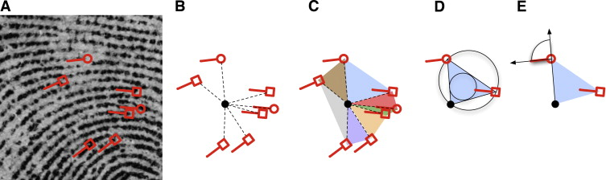
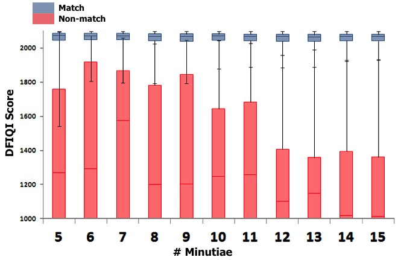

# Statistics for Forensic Science

In this section, we will first provide a brief review of probability and statistics. Then, we will outline the forensic examination and discuss where probability and statistics can contribute.  Two statistical approaches to assessing forensic evidence are described, one based on hypothesis testing and one based on the likelihood ratio. 

## Brief Review of Probability and Statistics

- Probability is...
    * the language for describing uncertainty.
    * a number, always between 0 and 1, to describe the likelihood of an event.
    * dependent on the information available (information conditioned on)
    * useful for deducing likely values for individuals or samples from given or hypothesized information about the population
- Probability distributions...
    * suppose we have a *random* quantity, like a trace element concentration in a glass fragment.
    * give possible values and relative likelihood of each value observed or observable. 
- Statistics...
    * draws inferences about a population (usually some characteristic of the population) based on sample data.
    * relies on careful definition of the "population" of interest.
    * relies on the method of data collection. 
    * is made up of a variety of *inference* procedures, like...
        + point estimates, 
        + confidence intervals, and 
        + hypothesis tests.

## The Forensic Examination

As you know there are a range of questions that arise in forensic examinations including those concerning source conclusions, timing of events, and cause & effect. We focus in this workshop on source conclusions. 

The evidence, which we will denote $E$, are items or objects found at the crime scene and on a suspect. $E$ can also denote the measurements of these items. For evidence found at the crime scene, we will occasionally write _______, and for evidence found on the suspect or in the suspect's possession, we will occasionally write ______.  There may also be other relevant information available to us, denoted $I$, such as the race of the perpetrator or evidence substrate.

In the source conclusions piece of the forensic examination, we can think of their being two hypotheses or propositions regarding the evidence: 

- $S$ : the items from the crime scene and from the suspect have __________ source. In other words, the suspect may be the ___________ of the crime scene item. \vspace{.1in}
- $\overline{S}$ : the items from the crime scene and from the suspect ___________ have a common source. 

The goal of the forensic examination is the assessment of evidence with respect to these hypotheses.

Obviously, there are many different types of forensic evidence:

- biological evidence (such as blood type or DNA)
- glass fragments
- fibers
- latent prints
- shoe prints or tire tracks
- and others

Different probability & statistics related issues will inevitably arise for different evidence types. For example: 

- Discrete and continuous variables are treated differently.
- What information is available about the probability distribution of observable measurements? 
- A reference database may or may not exist.
- What role does the manufacturing process play in our ability to determine if two items agree?

The Daubert standard^[*Daubert v. Merrell Dow Pharmaceuticals*, 509 U.S. 579] identifies the the judge as a _____________________ to determine the admissibility of expert scientific testimony. In order to determine admissibility, the judge can apply _____________ factors: \vspace{.1in}

- The theory or method should be ___________ \vspace{.1in}
- The theory or method should be subject to ____________ and _____________. \vspace{.1in}
- There are known or potential __________ rates.\vspace{.1in}
- The theory or method has ____________ and controls.\vspace{.1in}
- The theory or method is generally ____________ by the _____________ scientific community.

The National Research Council [@nrc09] found:\vspace{.1in}

- _______________ provider community (federal, state, & local) \vspace{.1in}
- _______________ across disciplines \vspace{.1in}
- Lack of ____________________ in practices \vspace{.1in}
- Insufficient _________________ \vspace{.1in}
- Questions underlying ________________ basis for some conclusions


In 2016, the President's Council of Advisors on Science and Technology released a report on the state of forensic science. [@pcast]. This report... \vspace{.1in}

- focused on the ___________ of ____________ matching disciplines: \vspace{.1in}
- examined foundational validity and the use of _____________________ studies \vspace{.1in}
- examined validity as ___________, including information at the examiner level.

The forensic science community as a whole is a community in transition. The National Commission on Forensic Science, which was established in 2013 to advise the U.S. Attorney General, was not renewed for a third term after its second term expired on April 23, 2017.^[https://www.washingtonpost.com/local/public-safety/sessions-orders-justice-dept-to-end-forensic-science-commission-suspend-review-policy/2017/04/10/2dada0ca-1c96-11e7-9887-1a5314b56a08_story.html?utm_term=.858a461dec18] To accompany the end of this commission, the Department of Justice (DOJ) released a call for comments on advancing forensic science, with comments closing on June 9, 2017.^[https://www.justice.gov/opa/press-release/file/956146/download]

There are additional federal organizations that are also involved in advancing the field of forensic science. For instance, the Organization of Scientific Area Committees (OSAC) for Forensic Sciences, administered by NIST, is a collection of committees focused on developing standards and best practices for each forensic discipline.^[https://www.nist.gov/topics/forensic-science/organization-scientific-area-committees-osac] In addition, NIST has funded a forensic science Center of Excellence, the Center for Statistics and Applications in Forensic Evidence (CSAFE), to complement their internal forensic science research.  NIJ funds a significant amount of forensic science research and has also funded the Forensic Technology Center of Excellence^[NIJ: https://forensiccoe.org/] (FTCoE) to assist with technology training and technology transfer. 

## Statistical Approaches to Assessing Forensic Evidence

In this section, we consider the two primary statistical approaches to assessing forensic evidence: statistical testing and likelihood-ratio-based approaches. We also address the current approach to forensic evidence in most of the pattern disciplines which relies on experience and training.   

### Significance Testing / Coincidence Probability

One common statistical approach^[This approach is also known as the *comparison/significance approach*.] solves the forensic problem in two stages:

1. First, we determine if the crime scene and suspect items ________ on a characteristic of __________. This is typically done using a hypothesis or a significance _______. \vspace{.1in}
2. Second, we assess the ________________ of this agreement by finding the likelihood of such agreement occurring by ________.

**Note**: DNA analysis can be categorized in this way, but it is usually thought of as a *likelihood ratio* approach. See Section \@ref(the-likelihood-ratio-approach) for more on this topic. 

In the significance testing / coincidence probability approach, determining agreement is straightforward for ________ data like blood type or gender. There are still _____________ in these cases due to the possibility of laboratory or measurement error. Usually, it is easier or more straightforward to think about discrete data in terms of the likelihood ratio. Again, see Section \@ref(the-likelihood-ratio-approach) for more. Statistical significance tests can be used for _____________ data like trace element concentrations (e.g. in glass fragments). 

For this approach, the testing procedure is outlined below: \vspace{.1in}

1. ________________ each object by a _______ value. For example, consider the mean trace element concentration in a *population* of glass fragments. This is the __________ mean in statistics terminology: there is one population mean for the glass from the crime scene and one population mean for glass from the suspect. \vspace{.1in}
2. Obtain _________ values from the ___________ object. \vspace{.1in}
3. Obtain _________ values from the ___________ object. \vspace{.1in}
4. Use the sample values from steps 2-3 to test the _______________ that the two objects have the same population __________. A common tool for testing is the $t$-test demonstrated earlier in Section \@ref(comparing-two-means).  \vspace{.1in} 
5. Summarize the test with the $p$-value, the ___________ of data like the observed data or more extreme, assuming population means are the same. \vspace{.1in}
6. A small $p$-value, typically small means $p < .05$ or _____, indicates there is no agreement between the two objects. If the $p$-value is larger, we can't ___________ the hypothesis that the two means are equal.^[But is this evidence that they came from the same population...?]

#### Examples 

First, consider two glass samples: one from a crime scene, and one from a sample recovered from the suspect. These data can be found in @curranetal. The null hypothesis ($H_0$) is that the two samples come from populations that have equal means ($\mu_{scene}=\mu_{suspect}$), and the alternative hypothesis ($H_A$) is that the two samples are from populations with different means ($\mu_{scene}\neq \mu_{suspect}$).

- Five measurements of ____________ concentration in crime scene sample: 
$$0.751, 0.659, 0.746, 0.772, 0.722$$
- Five measurements of ____________ concentration in recovered sample: 
$$0.752, 0.739, 0.695, 0.741, 0.715$$
```{r alums, echo = FALSE}
scene <- c(0.751, 0.659, 0.746, 0.772, 0.722)
mean_sc <- mean(scene)
recover1 <- c(0.752, 0.739, 0.695, 0.741, 0.715)
mean_rec1 <- mean(recover1)
recover2 <- c(0.929, 0.859, 0.845, 0.931, 0.915)
mean_rec2 <- mean(recover2)
```

- Sample means: 
    * Crime Scene: 0.730
    * Recovered Sample: 0.728
- Standard errors
    * Crime Scene: $\frac{0.0435}{\sqrt{5}}=0.019$
    * Recovered Sample: $\frac{0.023}{\sqrt{5}}=0.010$
- Test statistic (see Section \@ref(comparing-two-means)):
$$\frac{0.730 - 0.728}{\sqrt{0.019^2 + 0.010^2}} = \frac{0.002}{0.0215} = 0.0931 \approx 0.1$$
- $p$-value = 0.70 $\Rightarrow$ fail to reject the null hypothesis that the two samples come from populations with equal means.

In fact, ground truth is known here: all of these measurements came from the same bottle. 

Next, consider a different recovered sample. Again, the data are from @curranetal. The crime scene sample remains the same as the prior example. 

- Five measurements of aluminum concentration in the second recovered sample: 
$$0.929, 0.859, 0.845, 0.931, 0.915$$
- Sample means: 
    * Crime Scene: 0.730
    * Recovered Sample: 0.896
- Standard errors
    * Crime Scene: $\frac{0.0435}{\sqrt{5}}=0.019$
    * Recovered Sample: $\frac{0.0408}{\sqrt{5}}=0.018$
- Test statistic (see Section \@ref(comparing-two-means)):
$$\frac{0.730 - 0.896}{\sqrt{0.019^2 + 0.018^2}} = \frac{-0.166}{0.0262} = -6.38 $$
- $p$-value = 0.0015 $\Rightarrow$  Reject the null hypothesis that the two samples come from populations with the same mean.

In fact, ground truth is known here as well, and these two samples are from two different bottles. 

#### Other Significance Testing Approaches

Many methods exist for assessing forensic evidence that are closely related to the significance testing approach described here. For instance, 4-$\sigma$ (4-sigma) methods create an interval for each element in the "control" (crime scene) sample by taking the mean concentration of each element $\pm$ four standard errors of those means. Then one checks to see whether the mean concentration of the "test" (suspect) samples are in/out of the control interval. Hotelling’s $T^2$ (T-squared) test compares all elements simultaneously to account for the within-sample dependence among the elements. 

#### Concerns About Significance Testing Approaches

There are some **technical** concerns about the aforementioned procedures. The formal tests, the $t$-test and Hotelling’s $T^2$ test, require assumptions about the probability distribution of the data. In addition, when univariate procedures such as the $t$-test are repeated on multiple elements, the existence of this multiplicity of comparisons should be accounted for. Furthermore, the univariate procedures ignore information contained in the correlation of the elements. Multivariate procedures (like Hotelling’s test) address this correlation but require large samples. 

The bigger concerns with these procedures however are **conceptual**. 

- Significance tests do not treat the two hypotheses (equal means vs. unequal means) symmetrically. The null hypothesis, that the population means are equal, is *assumed* true unless the data *rejects* that hypothesis. Failing to reject the null in this setting is taken as evidence *against* the suspect (because the samples are found to be indistinguishable). This is the opposite of the courtroom setup where innocence is presumed until evidence is provided to reject that claim.  Thus, the asymmetry of the null and alternative hypotheses is an issue here. 
- The binary decision to reject the null hypothesis or fail to reject the null hypothesis requires the choice of a cutoff value like $p = 0.05$ or an interval width like 4$\sigma$.  Such choices are somewhat arbitrary.  Why 4$\sigma$ rather than 3$\sigma$? Why $p = 0.05$ rather than $p = 0.01$ or $p = 0.10$? 
- The match decision from the hypothesis test is separated from an assessment of the practical significance of the match.  This can be problematic. For a given set of sample means and sample standard deviations, a large sample size will increase the odds that we will reject the null hypothesis meaning that true matches could be misclassified as different sources. And conversely, a small sample size increases that odds that we will be unable to distinguish true non-matches. 
<!--Of course, we ultimately would need population distribution knowledge through collection of samples from several different classes and subclasses.-->

#### Alternatives to Significance Tests

**Equivalence testing** is an alternative to standard significance testing. Equivalence testing changes the null hypothesis that we consider and thereby addresses the first concern regarding asymmetric hypotheses. The likelihood ratio approach to assessing forensic evidence addresses the other concerns mentioned above: these methods avoid the binary (match/nonmatch) decision and they also eliminate the separation of match determination and significance assessment. We discuss these methods in more detail later on in Section \@ref(the-likelihood-ratio-approach). We briefly describe equivalence testing here. 

The usual hypothesis test assumes the null hypothesis is true until proven otherwise. **Equivalence testing** is an alternative approach that assumes the population means are *different*. This becomes the null hypothesis. Formally the equivalence testing approach requires us to specify the size of a "practically" important difference, $\Delta$. We then write the hypotheses as: 
\begin{equation}\label{eq:et}
\begin{split}
H_0 & :  |\mu_{scene} - \mu_{suspect} | \geq \Delta  \\
H_A & :  |\mu_{scene} - \mu_{suspect} | < \Delta  
\end{split}
\end{equation}
This requires that we test two different hypotheses: 

1. the means differ by more than ______ vs the alternative that they don't \vspace{.1in}
2. the means differ by less than ______ vs the alternative that they don’t

We reject the null hypothesis and conclude the samples are equivalent ONLY if we get a small $p$-value for both hypothesis tests.
 
Recall the example from Section \@ref(comparing-two-means) that compared two glass samples: 10 glass fragments taken from the crime scene ($Y$) and 9 glass fragments found on the suspect ($X$). The statistics recorded were: 

- $\overline{X} = 5.3$; $s_X = 0.9$; $SE(\overline{X}) = 0.28$ \vspace{.1in}
- $\overline{Y} = 5.9$; $s_Y = 0.85$; $SE(\overline{Y}) = 0.28$ \vspace{.1in}
- $SE(\{\overline{X} - \overline{Y}\}) = 0.4$

In Section \@ref(comparing-two-means) we tested the hypothesis $H_0 : \mu_X = \mu_Y$ and obtained a $p$-value of $0.15$. So, we failed to reject the null hypothesis meaning there was not evidence to reject the hypothesis that the two samples came from populations with equal means. (i.e. They could potentially have the same source.) 

To apply the *equivalence testing* approach, let's suppose a difference of 1.0 or more ($\Delta = 1.0$) is considered a practically important difference. Then the hypotheses for the first of the two tests are: 
\begin{equation}\label{eq:eth1}
\begin{split}
H_0 & : \mu_y - \mu_x \geq 1 \\
H_A & : \mu_y - \mu_x < 1 
\end{split}
\end{equation}

The observed difference is 0.6 with a standard error of 0.4. This observed difference is one standard error *below* the practically important difference of $\Delta = 1.0$ which results in a $p$-value of 0.32. (Note that if this first test yielded a small $p$-value, then we would need to test the second
hypothesis ($\mu_y - \mu_x \leq -1$) against the alternative ($\mu_y - \mu_x > -1$).  We do not do so here.) Because the $p$-value for the first hypothesis test is .32 the equivalence test does not reject **its** null hypothesis, and thus we cannot reject the possibility that the two samples come from populations with distinguishable means.  This example demonstrates the importance of the null hypothesis. The data fail to reject *either* of the null hypotheses that we considered, i.e., the 
data are consistent with the hypothesis of equal population means and with the hypothesis of different population means. 

#### Probability of a Coincidental Agreement

Now, let's return to the usual significance testing approach and assume we have found a statistical "match", meaning we could not reject the null hypothesis that the two samples come from populations with the same mean. The second stage of our analysis is assessing the "_______________" of the match. 
Note that we put significance in quotes here because the word "significance" has a formal statistical meaning that we are not using. We will try not to use that term here. Other terms we could use in place of "significance" are: 

- Strength of ____________ \vspace{.1in}
- __________ of evidence \vspace{.1in}
- Usefulness of ___________ \vspace{.1in}
- ___________ value

As an example from popular culture consider Consider the movie *The Fugitive* (1993).  In the movie the main character is wrongly accused of murdering his wife but knows that the true killer was a
one-armed man (See Figure \ref{fig:fugitive}.) This situation can be viewed in the context of our significance testing / coincidence probability approach.  Suppose we know that the true killer and the suspect in hand "match" in the sense that both are:

1. male. This provides us with very limited evidence because 50% of the population is male and would match this characteristic of the true killer.
2. one-armed males. This provides us with much stronger evidence because only a very small proportion of the population are one-armed males.

This step, where we quantify the strength or probative value of evidence is *crucial* for the courtroom setting. 

```{r fugitive, echo=FALSE, out.width='.5\\linewidth', fig.align='center', fig.cap="Harrison Ford's character on the hunt for the one-armed man who killed his wife. Image Source: http://www.imdb.com/title/tt0106977/", fig.pos="h"}

```

##### Probability of Coincidental Agreement: Discrete Data 

For discrete data like blood type and DNA, when we want to find the probability of a match by chance, there are several important considerations: 

1. This evidence is usually _____________ centered: material from scene is considered _________ and we want to compute the likelihood that an individual would have a similar object/characteristic. \vspace{.1in}
2. This evidence depends on relevant "___________". For instance, the suspect is male, the suspect is Chinese, etc. \vspace{.1in}
3. We have to consider what information is available to inform out assessment of the probability of a match due to chance.  For example this could be data from population records or convenience samples.

It turns out that computing the probability of coincidental agreement for discrete data is essentially one of the calculations the likelihood ratio approach so we don't discuss the topic further here. See Section \@ref(the-likelihood-ratio-approach) for more. 

##### Probability of Coincidental Agreement: Continuous Data 

For continuous data, finding the probability of a match (i.e., a failure to reject the hypothesis of equal population means) by chance is a bit more difficult. We need to determine the likelihood that objects (e.g. glass fragments) selected at random from the relevant population would match the crime scene sample. The basic idea is outlined below using terminology from the case where we are carrying out a two-sample $t$-test. (See Section \@ref(normal-data) for reference.)

1. Suppose for the moment we know the "population" mean of a randomly chosen glass source. 
2. We can find the probability that a $t$-test based on a sample from this *random* object will result in agreement (i.e., a failure to reject the null hypothesis) when compared with the *crime scene* sample. 
3. The total coincidental agreement probability is then an average over *all possible choices* for the random source: 
$$ \text{coincidence probability} = \sum\limits_{\text{pop.means}} Pr(\text{a mean}) Pr(\text{match to scene sample}\ |\ \text{a mean})$$

This procedure is technically challenging but it can be done! The key question is: Where does the information about the set of possible sources (i.e. the relevant population) come from?

**Example**

Let's illustrate this idea with an example. Consider again the data from @curranetal. Recall the crime scene sample, call it $X$, has 5 observations with a mean aluminum concentration of $\overline{X} = 0.730$ and standard deviation of $0.04$. 

Assume we will apply a standard statistical test <!--(see Section \@ref(statistical-details))-->  by taking 5 samples from an unknown randomly chosen glass source, and comparing those to the sample above using a two-sample t-test with a cutoff corresponding to a $p$-value of 0.05. So, we will only reject the null hypothesis (that the population mean of the random source is equal to the population mean of the crime scene sample) if the test statistic is so large that it has a less than 5% chance of occurring by chance. Any value that falls in the 95% non-rejection range will be deemed "indistinguishable" from the crime scene sample. 

Next, suppose that the means of *all* randomly chosen glass sources from the population of interest can be described using a normal distribution with mean $\mu = 0.83$ and standard deviation $\sigma = 0.10$. This distribution is shown in Figure \ref{fig:normglass}. Note that in this population of relevant glass sources some randomly chosen sources will have means near 0.73 and will be ________ to distinguish from the control sample. Some randomly chosen sources from the relevant population will have means near 0.83 and will likely be _____________ from the control sample. Other randomly chosen sources from the relevant population will have means near .93 and will be
________ to distinguish from the control sample. 

Under this setup, we can compute how likely it is to find a randomly chosen source which provides a sample that is indistinguishable from the crime scene sample. The answer is 0.24 or 24% of the time

```{r normglass, echo=FALSE, message=FALSE, fig.align='center', fig.pos='h', fig.cap='The population distribution of mean aluminum concentrations in all randomly chosen glass sources.', out.width='.5\\linewidth'}
ggdistribution(dnorm, seq(.43, 1.23, .01), mean = .83, sd = .1) + 
  scale_x_continuous(breaks = seq(.4,1.2,.2), 
                     labels = seq(.4,1.2,.2)) + 
   scale_y_continuous(breaks = seq(0, 4, 1), 
                     labels = seq(0, 4, 1)) + 
  theme_minimal() + 
  geom_vline(xintercept = 0.73, color = 'blue') + 
  geom_label(data = NULL, inherit.aes = FALSE, aes(x = .73, y = 3, label = "crime scene sample"), size = 3, hjust = 1.05, color = 'blue') + 
  geom_vline(xintercept = 0.83, color = 'forestgreen') + 
  geom_label(data = NULL, inherit.aes = FALSE, aes(x = .83, y = .25, label = "population mean"), size = 3, hjust = 1.05, color = 'forestgreen') + 
  geom_vline(xintercept = 0.93, color = 'red') + 
  geom_label(data = NULL, inherit.aes = FALSE, aes(x = .93, y = 3, label = "source with mean=.93"), size = 3, hjust = -.05, color = 'red') + 
  labs(y = "Density", 
       title = "Distribution of population means of Al concentration in glass sources", subtitle = "Normal(0.83, 0.10)") + 
  xlab("Mean Al concentration in a glass source") 
```

We can repeat the same approach to find coincidental match probabilities for different definitions of the relevant population (i.e., different assumptions about the mean and standard deviation in the relevant population). The table shown below gives the coincidence probabilities (cp) for different relevant populations.

```{r cptab, results='asis', echo = FALSE, message=FALSE}
means <- c(.73, .83, .93)
sds <- c(.2,.1,.05)
dats <- expand.grid(mean = means,sd = sds)
dats$neg4 <- dats$mean - 4*dats$sd
dats$pos4 <- dats$mean + 4*dats$sd
dats <- arrange(dats, mean, desc(sd))
dats$cp <- c(.20,.37,.65,.37,.24,.17, .12,.06,.002)
pander::pander(dats[,c(1,2,5)], caption="Coincidence probabilities for different population distributions.")
```

The moral of the story, is that the probability of a coincidental match is high when there is... 

- a small difference between the control sample and the population of randomly chosen sources (i.e. the crime scene/control sample is "ordinary").
- a large amount of heterogeneity among the potential sources in the population.
- a large amount of variability among the fragments in an individual source. (Note: we didn't show this in detail here but if the standard deviation of the measurements -- equal to .04 in the Curran et al. data -- increases then that will increase the probability of a coincidental match) 

<!--
#### Statistical Details

The "standard statistical test" referenced in the previous section is a 2-sample $t$-test for comparing the sample from a random source to the crime scene. Suppose you have two samples: $X_C = (x_{c1}, x_{c2},x_{c3},x_{c4}, x_{c5})$ from the crime scene, and $X_R = (x_{r1}, x_{r2},x_{r3},x_{r4}, x_{r5})$ from the random source. These samples have associated population means $\mu_C$ and $\mu_R$. The first step to compute the coincidence probability is to calculate $Pr(\text{match}|\text{mean})$, the probability of finding a match at random given the population mean. To do this, first we construct a hypothesis test for equal means: 

\begin{equation}
\begin{split}
H_0 & : \mu_C = \mu_R \\
H_A & : \mu_C \neq \mu_R
\end{split}
\end{equation}

We *fail to reject* this $H_0$ (determine the population means are indistinguishable) when the $p$-value from the hypothesis test is greater than or equal to $\alpha = 0.05$. So, the value $Pr(\text{match}|\text{mean})$ is the probability of failing to reject this null hypothesis for a given possible mean value from the population. (On slide 91, this value is 0.83. On slide 92, other values are 0.73 and 0.93.) To calculate this, we need to compute the test statistic $T$ for a $t$-test of comparison of 2 means:

$$T = \frac{\overline{X_R} - \overline{X_C}}{\sqrt{(\frac{sd_{R}}{\sqrt{n}})^2 + (\frac{sd_{C}}{\sqrt{n}})^2}} = \frac{\overline{X_R} - .73}{\sqrt{(\frac{0.04}{\sqrt{5}})^2 + (\frac{0.04}{\sqrt{5}})^2}}$$

Note that we have made the assumption that the standard deviation from the crime scene sample is the same as the standard deviation from the random sample.  We cannot calculate $T$ exactly because the sample $X_R$ is hypothetical: we want to generalize for *any* sample from *any* random source. We do, however, have additional information about what our conclusion will be: we reject if the value of $T$ is so large as to give us a $p$-value of less than 0.05. The rejection region for this $t$-test (see Figure \ref{fig:pvals} for example) is the value under a $t_4$ distribution that gives us 0.025 under the curve on either side. The $t_4$ is a $t$ distribution with 4 degrees of freedom. (Degrees of freedom for this type of test are always the smalles sample size minus one, or $5-1=4$.) Using a $t$-table or otherwise, we find that the value with 0.025 below is -2.77 and the value with 0.025 above is 2.77 (the $t$-distribution is symmetric). Using all the above information, we can rewrite $Pr(\text{match}|\text{mean})$ as: 

\begin{equation}
\begin{split}
Pr(\text{match}|\text{mean}) & = Pr(|T| < 2.77 | \text{mean = .83}) \\
& = Pr(-2.77 \leq \frac{\overline{X_R} - .73}{\sqrt{(\frac{0.04}{\sqrt{5}})^2 + (\frac{0.04}{\sqrt{5}})^2}} \leq 2.77 | \mu_R = .83) \quad \textit{Let's simplify...}
& = Pr(-2.77 \leq \frac{\overline{X_R} - .73}{0.0253}} \leq 2.77) \\
& = Pr(-2.77\cdot 0.0253 \leq \overline{X_R} - .73 \leq 2.77\cdot 0.0253) \\ 
& = Pr(-2.77\cdot 0.0253 +0.73 \leq \overline{X_R} \leq 2.77\cdot 0.0253 + 0.73) \\ 
\Rightarrow Pr(\text{match}|\text{mean}) & = Pr(0.660 \leq \overline{X_R} \leq 0.800)
\end{split}
\end{equation}

It is known that $X_R$ comes from a normal distribution with mean 0.83 and standard deviation 0.10 (slide 91). It is a well-know statistical fact that the mean of a sample from a Normal($\mu$, $\sigma$) distribution is also normally distributed with mean $\mu$ and standard deviation of $\frac{\sigma}{\sqrt{n}}$. Thus, the probability of finding a match at random *for a given mean of 0.83* is the area under the curve for a Normal(0.83, $\frac{0.1}{\sqrt{5}}$) distribution from 0.660 to 0.800. This is visualized in Figure \ref{fig:matchprob}. 

```{r matchprob, echo=FALSE, fig.cap="A visual representation of the match probability ($Pr(\text{match}|\text{mean})$) given a mean.", fig.align='center', eval = FALSE}
df <- data.frame(mean = numeric(0L), sd = numeric(0L), x = numeric(0L), dens = numeric(0L))
for (i in 1:nrow(dats)){
  x <- seq(dats$neg4[i], dats$pos4[i], by = dats$sd[i]/100)
  dens <- dnorm(x, mean = dats$mean[i], sd = dats$sd[i])
  df2 <- data.frame(mean = dats$mean[i], sd = dats$sd[i], x = x, dens = dens)
  df <- rbind(df,df2)
}

SE <- sqrt(2*(.04/sqrt(5))^2)
# lower value of inside integral
low_int <- -2.77 * SE + 0.73
# upper value of inside integral
upp_int <- 2.77 * SE + 0.73
dats$low_tprob <- NA
dats$high_tprob <- NA
for(i in 1:nrow(dats)){
  dats$low_tprob[i] <- pnorm(low_int, mean = dats$mean[i],
                             sd = dats$sd[i]/sqrt(5))
  dats$high_tprob[i] <- pnorm(upp_int, mean = dats$mean[i],
                             sd = dats$sd[i]/sqrt(5))
}
dats$matchprob <- dats$high_tprob - dats$low_tprob

for(i in 1:nrow(dats)){
  dats$low_nprob[i] <- pnorm(dats$mean[i] + dats$sd[i], mean = dats$mean[i],
                             sd = dats$sd[i]/sqrt(5))
  dats$high_nprob[i] <- pnorm(upp_int, mean = dats$mean[i],
                             sd = dats$sd[i]/sqrt(5))
}

powerfun <- function(mu, sd) {
   1 -  pnorm(2.77*SE + .73, mean = mu, sd = sd) +  pnorm(-2.77*SE + .73, mean = mu, sd = sd)
}

allmeans <- seq(0, 1.7, .005)
powerdat <- data.frame(sd = rep(c(.2, .1, .05), each =length(allmeans)), mu = rep(seq(0, 1.7, .005), 3))
powerdat$pow <- powerfun(mu = powerdat$mu, sd = powerdat$sd)
# power function plot
ggplot(data = powerdat) + 
  geom_line(aes(x = mu, y = 1- pow)) + 
  facet_grid(. ~ sd, labeller = "label_both") + 
  theme_bw() + 
  labs(x = "mean", y = "Pr(match|mean)")
```
 
```{r normglass2, echo = FALSE, eval = FALSE}

# dats$ses <- sqrt((0.04/sqrt(5))^2 +(dats$sd/sqrt(5))^2)
# df <- data.frame(mean = numeric(0L), sd = numeric(0L), x = numeric(0L), dens = numeric(0L))
# for (i in 1:nrow(dats)){
#   x <- seq(dats$neg4[i], dats$pos4[i], by = dats$sd[i]/100)
#   dens <- dnorm(x, mean = dats$mean[i], sd = dats$sd[i])
#   df2 <- data.frame(mean = dats$mean[i], sd = dats$sd[i], x = x, dens = dens)
#   df <- rbind(df,df2)
# }
# 
# xt <- seq(-1,1, .01)
# denst <- dt(xt, 4)
# xt2 <- xt + .73
# myt <- data.frame(x = xt2, y = denst)
# 
# # ses <- sqrt((.04/sqrt(5))^2 + (df$sd/sqrt(5))^2)
# ses <- (.04/sqrt(5))
# df$upp <- 2.77*ses + .73
# df$low <- -2.77*ses +.73
# 
# df$xt <- ifelse(df$x < df$upp & df$x > df$low, df$x, 0)


ggplot() + 
  # geom_segment(data = df %>% filter(xt > 0), aes(x=xt, xend=xt, y = 0, yend = dens), color = 'blue') +
  geom_line(data = df, aes(x = x, y = dens)) + 
  facet_grid(mean~sd, labeller = 'label_both', scales = 'free') + 
  theme_bw() #+ 
  #labs(x = "Mean Al Concentration", y = "Density", 
   #    title = "Coincidence probabilities for different population means and standard deviations", 
   #    subtitle = "Blue shaded area is the coincidence probability, black line is the population distribution")

# check myself
# dats
# dats$upper <- NA
# dats$lower <- NA
# for(i in 1:nrow(dats)){
#   dats$upper[i] <-  pnorm(2.77*dats$ses[i] + .73, mean = dats$mean[i], sd = dats$sd[i])
#   dats$lower[i] <- pnorm(-2.77*dats$ses[i] + .73, mean = combos$mean[i], sd = combos$sd[i])
# }
# 
# se1 <- sqrt((.04/sqrt(5))^2 + (.1/sqrt(5))^2)
# se2 <- sqrt((.04/sqrt(5))^2 + (.2/sqrt(5))^2)
# se05 <- sqrt((.04/sqrt(5))^2 + (.05/sqrt(5))^2)
```
--> 

### The Likelihood Ratio Approach

The goal for the ______ of _______ in a courtroom setting is to make a decision about the relative likelihood of two hypotheses or propositions (e.g. same source or different source) *given* the data. In statistical terms, this is a **Bayesian formulation** because we ask for probabilities about the state of the world *given* observed data. Recall from Section \@ref(bayes-rule) Bayes' Rule (or Bayes' Theorem): we can express the probability of A *given* B in terms of information about the probability of A and the probability of B *given* A 

$$P(A|B) = \frac{P(B|A)P(A)}{P(B|A)P(A) + P(B|\bar{A})P(\bar{A})}$$
<!--\clearpage --> 

Bayes' rule is a way of __________ the direction of conditional probabilities. We can go from statements about the likelihood of the **evidence** given the ___________ to statements about the likelihood of the **hypotheses** given the ___________. 

Applying Bayes' rule for evidence ($E$) and the same source hypothesis ($S$) we write: 

$$P(S|E) = \frac{P(E|S)P(S)}{P(E|S)P(S) + P(E|\overline{S})P(\overline{S})}.$$

Recall from Section \@ref(bayes-rule-to-the-likelihood-ratio) that Bayes' Rule can be rewritten in terms of the odds in favor of the same source hypothesis (left-hand side of the equation) given the evidence: 

$$\frac{P(S|E)}{P(\overline{S}|E)} = \frac{P(E|S)}{P(E|\overline{S})}\frac{P(S)}{P(\overline{S})}$$

In words, we can describe the above equation as "the posterior odds in favor of the same source hypothesis is equal to the likelihood ratio of the evidence times the prior odds of the same source hypothesis." The *likelihood ratio* (sometimes called the Bayes Factor) is a measure of the value of the evidence. It does *not* depend on one's prior beliefs about the same source hypothesis. 

\begin{equation}\label{eq:lr}
LR = \frac{P(E|S)}{P(E|\overline{S})}
\end{equation}

The term "likelihood" is used because if $E$ includes continuous measurements, then we cannot talk about the probability of single events. The likelihood ratio could, in principle, be used with $E$ representing "all" evidence in the investigation (more on this later). Other available information can be incorporated into the LR (more on this later as well). 

The **interpretation** of the likelihood ratio is crucial. The derivation of the LR (see Equation \ref{eq:7}) shows that the LR is a factor that we should use to change our opinions about the odds of the same source proposition. Some proposals have been made for scales that map LRs to words, e.g.,

- LR from 2-10 implies _____ support of the same source hypothesis\vspace{.1in}
- LR from 10-100 implies ________ support of the same source hypothesis\vspace{.1in}
- See page 17 of http://enfsi.eu/wp-content/uploads/2016/09/m1_guideline.pdf for the complete scale from ENFSI (European Network of Forensic Science Institutes) 

There is some confusion about terminology, specifically about how the likelihood ratio and the Bayes factor relate to each other. The LR (which is often called the Bayes Factor) plays a central role in a Bayesian approach to forensic evidence: it is the quantity used to update *a priori* odds in order to obtain posterior odds. The distinction between the LR and the Bayes factor is technical and has to do with how statistical parameters are treated. 

Let's return to Equation \ref{eq:lr}. The numerator, $P(E|S)$ assumes the _________ source hypothesis is true and asks about the likelihood of observing the evidence in that case. This value is somewhat related to the significance test determining if two samples match (i.e., have matching population means) but there is no binary decision regarding match/nonmatch in the LR approach. Instead, the numerator of the LR is a quantitative measure of the likelihood of the evidence under the same source hypothesis, $S$. The denominator, $P(E|\overline{S})$, assumes the ________ _______ hypothesis is true and asks about the likelihood of the evidence in that case. This is analogous to computing the coincidental match probability, as we did in Section \@ref(strength-of-evidence-continuous-data). Here too, as in the numerator, we do not require a binary decision regarding a match. The denominator is a quantitative measure of the likelihood of the evidence under ______. 

The LR approach makes explicit the need to consider the evidence under _____ different hypotheses. It also separates "____________" information about evidence from "___________" assessments of the same source hypothesis $S$. There is some subtlety here. Do not fall prey to the...

- Prosecutor's _________: interpreting $P(E|\overline{S})$ as $P(\overline{S}|E)$. i.e. if evidence is unlikely under $\overline{S}$ that fact is mistakenly interpreted as saying that $\overline{S}$ is unlikely. \vspace{.1in}
- ____________ attorney's fallacy: another misinterpretation of $P(E|\overline{S})$ in which one argues that if $P(E|\overline{S}) = \frac{1}{1,000,000}$, then there are 300 other people in the U.S. who could have been the source (and thus committed the crime). 

To being talking about how the likelihood ratio approach might be implemented we define $E=(x,y)$, where $y$ represents measurements of the evidence from the crime scene, and $x$ represents measurements of evidence from the suspect. Then, we can rewrite the likelihood ratio using laws of probability from Section \@ref(conditional-probability): 

\begin{equation}\label{eq:lrredo}
\begin{split}
LR & = \frac{P(E|S)}{P(E|\overline{S})} \\
  & = \frac{p(x,y | S)}{p(x,y | \overline{S})} \\ 
  & = \frac{p(y | x, S)}{p(y | x, \overline{S})} \cdot \frac{p(x| S)}{p(x| \overline{S})} 
\end{split}
\end{equation}

Often, the likelihood of $x$ is the same for ______ and ______, i.e. $p(x| S)= p(x| \overline{S})$. In other words, the distribution of the suspect's data (known source) does not depend on whether $S$ or $\overline{S}$ is true. (For some types of evidence it may be more appropriate to reverse the roles of $x$ and $y$ but we don't worry about that here.) This leads to yet another way to write the likelihood ratio: 

\begin{equation}\label{eq:lr3}
LR = \frac{p(y | x, S)}{p(y | x, \overline{S})}
\end{equation}

So, the likelihood ratio is the ratio of the probability of observing evidence measurement $y$ at the crime scene *given* the suspect evidence measurement $x$ **and** the same source assumption, to the probability of observing evidence measurement $y$ at the crime scene *given* the suspect evidence measurement $x$ **and** the different source assumption. 

Let's assume we start with Equation \ref{eq:lr3}:

- In the ___________ case, the numerator (probability of observing $y$ at the crime scene *given* the observation $x$ for the suspect sample **and** the same source assumption) is typically 0 or 1, or values really close to those. (We should always remember to consider the possibility of a lab error or contamination.) The denominator (probability of observing $y$ at the crime scene *given* the observation $x$ for the suspect sample **and** the different source assumption) is then the probability of a _____________ match. \vspace{.1in}
- In the _____________ case, the numerator is a measure of how likely it is to observe the numbers $(x,y)$ if they represent multiple measurements from the same source. The denominator is a measure of how likely it is to observe the numbers $(x,y)$ if they are measurements from two different sources. 

#### Example

Suppose the evidence is the blood type for a crime scene sample and the blood type for a suspect sample. We have information about the distribution of blood types in the U.S. population:
\begin{tabular}{l|cccc}
Type & A & B & AB & O \\
U.S. frequency & 0.42 & 0.10 & 0.04 & 0.44
\end{tabular}

Suppose both samples are observed to be of blood type O. Then, $Pr(y = O|x = O,S) \approx 1$. We'd expect to see the same blood type if the samples come from the same source. 
Conversely, $Pr(y = O|x = O,\overline{S}) = 0.44$. Blood type O is fairly common in the U.S. So the LR is $LR \approx \frac{1}{0.44} \approx 2.27$. Following the ENFSI language, the blood type evidence in this example provides _______ support for the "same source" hypothesis. Blood type AB, however, is rare in the U.S. If the two samples were both AB, then the LR would indicate stronger evidence in favor of the same source hypothesis (the LR would be $\approx \frac{1}{.04} \approx 25$). 

#### Where it works: DNA

A DNA profile identifies the alleles at a number of different locations along the genome. For example, suppose the alleles in a given sample at location TH01 are 7,9. As with blood type, we may see matching profiles for the crime scene sample and from the suspect's sample. The numerator is approximately one, as in the blood type example, because two DNA samples from the same source will have the same alleles (unless there is contamination or a genotyping error). We can determine the probability of a coincidental match for each marker or location from data giving the population distribution of allele frequencies.  For location TH01 that distribution is: 

\begin{tabular}{lccccccccc}
TH01 & 4 & 5 & 6 & 7 & 8 & 9 & 9.3 & 10 & 11 \\ 
Freq. & 0.001 & 0.001 & 0.266 & 0.160 & 0.135 & 0.199 & 0.200  & 0.038 & 0.001
\end{tabular}

The probability that a random sample will agree with the known sample in having alleles 7, 9 at location TH01 is $2(.16)(.199) = .064$. Thus, the LR based on this single location is $\frac{1}{0.064} \approx 15$. 

DNA evidence consists of data for a number of locations (CODIS used 13 locations pre-2017). The locations, each on a different chromosome, are independent. Recall that if events are independent, then we can multiply their probabilities
(which in this case is equivalent to multiplying likelihood ratios). So, a match at *all* locations can lead to likelihood ratios in the **billions** (or even larger). 

The likelihood ratio approach works well for DNA because the underlying biology is well understood. The probability model for the evidence follows directly from genetic theory and population databases are available for computing the random match probabilities. In addition, for single-source DNA samples, the methodology has been peer–reviewed and is well accepted by the scientific community. There are still complications that arise with DNA evidence. For example, allele calling still has some subjective elements and DNA samples containing multiple sources (i.e. DNA mixtures) still are not understood as well as single-source samples. 

#### Where it can work: Trace evidence

Glass and bullet lead are examples of where the likelihood ratio approach can potentially work. We can measure chemical concentrations of elements in glass or bullet lead and/or refractive indiced for glass. How might we construct a likelihood ratio for evidence of this type? We can motivate a possible approach with some graphs from elemental analyses of bullet lead (see Figure \ref{fig:projs}) and refractive indices of glass (see Figure \ref{fig:wibw}). 

```{r projs, echo=FALSE, out.width='32%', fig.cap="Three projections of 5-dimensional bullet lead trace element data.", fig.show='hold'}
knitr::include_graphics(c("img/proj1.png", "img/proj2.png", "img/proj3.png"))
```

```{r wibw, echo = FALSE, message = FALSE, warning = FALSE, out.width='32%', fig.cap="From left to right: multiple glass source samples where refractive index was reported, the same measurements for just one of those sources, and the data from the middle source on the same $x$ axis as all three sources.", fig.show='hold'}
gs1 <- rnorm(500, 1.517, .001)
gs2 <- rnorm(500, 1.519, .001)
gs3 <- rnorm(200, 1.523, .001)
gs4 <- rnorm(200, 1.525, .001)
ggplot() + 
  geom_histogram(aes(x = c(gs1, gs2, gs3, gs4, 1.5102, 1.5104, 1.531, 1.526)), bins = 50, fill = NA, colour = 'black') +
  theme_minimal() + 
  scale_x_continuous(breaks = seq(1.505, 1.535, .005), labels = seq(1.505, 1.535, .005), name = "refractive index",limits = c(1.505, 1.535)) + 
  labs(ylab = "Frequency", title = "Multiple Samples (between-sample variability)")

gs4 <- rnorm(50, 1.52, .00005)
ggplot() + 
  geom_histogram(aes(x = gs4), bins = 30, fill = NA, colour = 'black') +
  theme_minimal() +
  scale_x_continuous(breaks = seq(1.5197, 1.5201, .0001), labels =  seq(1.5197, 1.5201, .0001), 
                     limits = c( 1.5197, 1.5201)) + labs(ylab = "Frequency", title = "Single Sample (within-sample variability)")

ggplot() + 
  geom_histogram(aes(x = gs4), bins = 30, fill = NA, colour = 'black') +
  theme_minimal() +
  scale_x_continuous(breaks = seq(1.505, 1.535, .005), labels = seq(1.505, 1.535, .005), name = "refractive index",limits = c(1.505, 1.535)) + labs(ylab = "Frequency", title = "Single Sample (within-sample variability)")
```
We focus here on glass. (Compositional analyses of bullet lead are no longer carried out in the U.S.) A conceptual discussion of the likelihood ratio approach for glass analysis is described by @aitkenlucy. They take $y$ and $x$ to be trace element concentrations for a single element (or multiple elements) from several glass fragments at the crime scene ($y$) and from several glass fragments obtained from the clothing of the suspect ($x$). They assume a normal distribution for trace element concentrations though this assumption may be more reasonable for the natural log values of the concentrations. In this setup, under the same source hypothesis $S$, $x$ and $y$ are two sets of measurements from a single source (i.e. from a single normal distribution). But, under the different source hypothesis, $\overline{S}$, $x$ and $y$ are sets of measurements from two different sources (i.e. from
two different normal distributions drawn from the relevant population of possible sources). 

It is possible compute a likelihood ratio in this scenario if we have information about: 

1. The _________ of repeated measurements from a _________ source. \vspace{.1in}
2. The variability among ______ measurements from __________ sources in the population of interest.\vspace{.1in}
3. The average or typical measurement for random sources in the population of interest.

Key findings obtained by applying the Aitken and Lucy approach are summarized below:

1. The LR is small if $y$ and $x$ are very different (i.e., are inconsistent with the same source hypothesis)
2. The LR is big if $y$ and $x$ are similar and $y$ is unusual for the population of interest (i.e. they are indistinguishable on an unusual value)
3. Their examples find typical LRs in the 100s or 1000s.
4. Aitken and Lucy also show how to take the likelihood ratio approach without the strong assumption that measurements follow a normal (or lognormal) distribution.

In conclusion, the LR approach can work for trace evidence when

1. there is a well-defined set of ___________ (e.g. chemical concentrations)\vspace{.1in}
2.  there exist plausible probability models to describe ____________ within a sample (e.g. normal distribution or less restrictive models)\vspace{.1in}
3. it is possible to sample from a population (e.g. other windows) to assess variation across different sources.

This can be and has been done: 

- In @aitkenlucy for glass
- In @aliciaetal for bullet lead

There are challenges however.  Likelihood ratios can be very sensitive to the assumptions that are made about measurement distributions.  Also, assessing the relevant "population" is hard and will require careful evaluation of the circumstances in a given case.  

#### Where it might work: Pattern evidence

Many forensic disciplines are focused on comparing a sample from the crime scene (the "unknown" or "____________") and a sample from a potential source (the "known"). The goal is to assess whether the two samples have the __________ source or two different sources. There are many examples of trace evidence in forensic science (See Figure \ref{fig:trace}): 

- Latent prints^[Image source: http://science.sciencemag.org/content/309/5736/892/F4]
- Shoe prints ^[Image source: @shoepic]
- Tire tracks 
- Questioned documents ^[Image source: http://forensicunit.weebly.com/evidence.html]
- Firearms
- Tool marks
         
```{r trace, echo=FALSE, out.width = '32%', fig.show='hold', fig.cap='Examples of pattern evidence comparisons where there is potential application of the likelihood ratio approach for source determination. From left to right: latent print, shoe print, and questioned signature comparisons.'}
knitr::include_graphics(c("img/mayfieldfinger.jpg", "img/shoecompare.jpg", "img/signature.jpg"))
```

There are a number of challenges in constructing likelihood ratios for pattern evidence: 

1. The data are very ______ _________ (often are images). \vspace{.1in}
2. There is a great deal of flexibility (subjectivity?) in defining the number or types of __________ to look at. \vspace{.1in}
3. There is a lack of probability models for _____________ features or patterns. \vspace{.1in}
4. There is a need to study ___________ across a relevant population. 

These challenges are very hard to overcome but there is work underway to create the necessary statistical foundations for pattern evidence. 

Consider the representation of latent fingerprints shown in Figure \ref{fig:finger} which is taken from @neumann15. In the authors' approach, each minutiae is characterized by direction/angle, type of minutiae, and shape/configuration. Neumann et al. compute separate likelihood ratios for each of these characteristics, where the ___________ is based on variation within the same finger (obtained from a distortion model) and the ______________ is based on variation observed between matching features from different fingers (obtained using the nearest non-match from a database search). 

```{r finger, echo=FALSE, fig.align='center', out.width='.75\\linewidth', fig.cap="'Extraction of the variables considered by the model from the raw information available on the image of a finger impression. From left to right: (a) annotation of the minutiae on the fingerprint image distinguishing ridge endings (round) and bifurcations (square); (b) definition of the centroid and organization of the minutiae with respect to the centroid; (c) creation of the triangles; (d) extraction of shape variables for one triangle and (e) extraction of the type and direction variables of the minutiae for one triangle (the variables for all triangles are similarly extracted).' (Caption from Neumann et al, p. 158)"}

```

#### Score-based likelihood ratios

Given the challenges in developing LRs for pattern evidence,  there is some interest in a *score-based* approach. With this approach, we define a *score* measuring the "____________" between the questioned and known samples. We then obtain the ________________ of scores for a sample of *known matches* and we also obtain the distribution of scores for a sample of known ______________. See Figure \ref{fig:score1}.

```{r score1, fig.align='center', out.width='.5\\linewidth', fig.cap="For a sample of known matches and known non-matches, the distribution of scores for the different populations.", echo = FALSE, message =FALSE}
x <- c(0:1000)/10
knm <- dnorm(x, 40, 15)
km <- dlnorm(x,2,1.5)
df <- data.frame(x=rep(x,2), dens=c(km, knm), grp = rep(c("Known Matches", "Known Non-Matches"), each = length(x)))
p <- ggplot() + 
  geom_line(data = df, aes(x=x, y = dens, color = grp))  + 
  scale_color_manual(values=c('black',"red")) + 
  geom_text(data = NULL, inherit.aes = FALSE,  aes(x = c(3,55), y = c(.08,.02), label = unique(df$grp)), size = 3, hjust = 0) + 
  theme_minimal() + 
    theme(legend.position = 'none') 
p
```

The basic idea behind the score-based likelihood approach is outlined as follows: 

1. Fit a probability ________________ to the scores ($D$) of known matches ($Pr(D | S)$) where $S$ is the hypothesis that the two samples have a common source. \vspace{.1in}
2. Fit a probability distribution to the scores of known nonmatches ($Pr(D | \overline{S})$) where $\overline{S}$ is the hypothesis that the two samples have different sources. \vspace{.1in}
3. Calculate the score-based likelihood ratio when we observe score $D$ as $SLR = \frac{Pr(D | S)}{Pr(D | \overline{S})}$. (See Figure \ref{fig:score2}). 

```{r score2, echo = FALSE, message=FALSE, fig.cap="The score distributions for known matches and known non-matches with the values in the score-based likelihood ratio calculation shown on the distributions.", out.width='.5\\linewidth', fig.align='center'}
segments <- subset(df, x ==10)

p + 
  geom_segment(data=segments, inherit.aes = FALSE, 
               aes(x = x, xend = x, y = 0, yend = dens, color = grp)) + 
  geom_point(data = segments, aes(x=x, y = dens, color = grp)) +
  geom_label(data = segments, inherit.aes = FALSE, aes(x=x, y = dens, label = c("Height of black line is Pr(D|S)","Height of red line is Pr(D|not S)")), size = 3, hjust = -.05) 
```

The score-based likelihood approach is being developed for bullet land signatures by @hare. Hare et al. defined a number of different measures or scores that summarize the similarity of two bullet lands such as the number of consecutive matching striae and the value of the cross-correlation function. Figure \ref{fig:comparebullet} shows an example of two bullet land signatures that have been aligned for comparsion. The empirical score distributions for known matches and known nonmatches are shown in Figure \ref{fig:scorebullet}. 

```{r scorebullet, echo = FALSE, fig.align='center', out.width='.65\\linewidth', fig.cap='Distributions of various "scores" when comparing bullet lands. Known matches in light blue, known non-matches in dark blue. Figure from Hare et al.'}
knitr::include_graphics("img/density-overview-1.pdf")
```


```{r comparebullet, echo = FALSE, fig.align='center', out.width='.65\\linewidth', fig.cap='An example of a bullet land comparison used to calculate the scores. Figure from Hare et al.'}
knitr::include_graphics("img/smoothmatch-1.pdf")
```

Across a number of existing examples (e.g., the bullet land data) the score distribution for known matches seems relatively straightforward to characterize. There are, however, challenges in defining the relevant *non-match* population:

- Is there a single non-match score distribution that can be used for all cases?
- Or should the non-match score distribution depend on some characteristics of the given crime scene sample?

Another example of using score-based likelihoods is the Defense Forensic Science Center's (DFSC) approach to latent print score evaluation.^[Source: https://www.samsi.info/wp-content/uploads/2016/03/SAMSI-2016-Swofford-DFIQI-A_and_C-Combined_HJS_REVISED.ppt]  Boxplots showing the score distributions for known matches and non-matches for a given number of matching minutiae are shown in Figure \ref{fig:minutiae}. 

```{r minutiae, echo=FALSE, fig.align='center', out.width='.5\\linewidth', fig.cap='The score function values for known matches (blue) and known non-matches (red) by the number of matching minutiae.'}

```

#### Closing thoughts on LRs

There has been discussion in the forensic community about contextual bias and task-relevant/task-irrelevant information. In particular the question of how to distinguish between task-relevant and task-irrelevant information has been raised. One advantage of the likelihood ratio framework is that it can easily accommodate task-relevant information. Let $E$ represent the evidence, $S$ represent the same source proposition, and $I$ represent other task-relevant information that is being considered. We can condition on this information in the LR:
$$LR = \frac{Pr(E|S,I)}{Pr(E|\overline{S},I)}$$
The information $I$ should include task-relevant information (e.g. substrate used), but $I$ should *not* include task-irrelevant information such as results of other forensic evidence analyses in this case or other case information. 

In addition, the likelihood ratio can accomodate multiple types of evidence, say $E_1$ and $E_2$: 
$$LR = \frac{Pr(E_1,E_2|S)}{Pr(E_1, E_2|\overline{S})}$$
If these evidence types are independent, then the above expression simplifies to: 
$$LR = \frac{Pr(E_1|S)}{Pr(E_1|\overline{S})}\cdot \frac{Pr(E_2|S)}{Pr(E_2|\overline{S})}$$

If the evidence types are *dependent*, however, determining their joint probability (the probability of $E_1,E_2$ occuring together) can be extremely difficult. 

Many issues can complicate the calculation of LRs in practice. Examples include:

- accounting for the transfer process with glass or fibers
- accounting for heterogeneity due to packaging of bullets into boxes 
- accounting for usage/lifetime of products (e.g. sneakers)

Though good work is being done, it seems likely that it will be some time before LRs are available for pattern evidence. In addition, it is important to remember that there is not one single LR for a given item of evidence. The LR calculation depends on assumptions made about the probability models for the measured data and on assumptions about the relevant population.
Lund and Iyer (Journal of Research of NIST, forthcoming)^[https://www.nist.gov/nist-research-library/journal-research-nist#vol] show that the range of plausible LRs can be extremely wide! 

In summary, there are advantages and disadvantages to the likelihood ratio approach. Some advantages are:

- Explicit comparison of the two relevant hypotheses/propositions
- Provide a quantitative summary of the evidence
- There is no need for arbitrary match/non-match decisions when faced with continuous data
- It can accommodate a wide range of relevant information
- There is enough flexibility to accommodate multiple types of evidence

Some disadvantages are: 

- Requires assumptions about the distribution of measurements (and the LR can vary considerably)
- The need for a reference distribution to define the denominator (although this needs to be done implicitly in any examination).
- It can be difficult to account for all relevant factors
- It is unclear how this information should be conveyed to the trier of fact

### Forensic Conclusions as Expert Opinion

The previous sections have focused on statistical approaches such as hypothesis tests and likelihood ratios to make forensic conclusions. The status quo in pattern evidence disciplines, however, does not use such methods. Instead, forensic evidence enters the courtroom through expert testimony. Expert analysis is based on experience, training, and the use of accepted methods. There are some issues to consider with this approach:

- What is the range of conclusions that ought to be reported?
    * identification, inconclusive, exclusion ?
    * multi-point scales: some support, strong support, very strong support, etc ?
- Testifying in this way requires assessing the reliability and validity of the expert opinion. (This is one of the primary recommendations of the PCAST report.) 

Statistical methods are relevant to carrying out reliability and validation studies. Some common terminology:

- Reproducibility - how often would the _________ examiner reach the __________ conclusion for the given evidence \vspace{.1in}
- Reliability - how often would ____________ examiners reach the __________ conclusion for the given evidence \vspace{.1in}
- "White Box" studies - studies of repeatability and reproducibility of different aspects of the forensic examination
- Validation studies
    * "Black Box" studies of performance - examiners given cases with known "ground truth" to assess frequency of different types of errors e.g. @uleryetal for latent prints. 
    * One way to think about this is that now $E=$ examiner's conclusion, and we need to assess $P(E|S)$ and $P(E|\overline{S})$
    * Study design is extremely important (see Section \@ref(probability-to-statistical-inference)). 
    
Reproducibility, reliability, and validity are likely to depend on characteristics of the evidence. For example, 

- The quality of a latent print 
- The complexity of someone's signature

Ideally such characteristics can be integrated into reliability/validity studies, which would enable reports of the kind "for evidence of this type...." 

There will always be unique situations (e.g., did this typewriter produce this note?) for which there are no relevant validation/reliability studies. This is not a problem, but the conclusions expressed by the expert in such settings must acknowledge ____________ about the likelihood of a coincidental agreement.

### Workshop Summary / Conclusions

1. Quantitative analysis of forensic evidence requires some familiarity with concepts from probability and statistics
2. The workshop reviewed basics of probability and statistics
3. Reviewed testing-based approaches and likelihood ratios for forensic examinations
4. We took away some key points:
    a. Any approach must account for the two (or more) competing hypotheses about how the data was generated
    b. Need to be explicit about our reasoning and the data on which that reasoning is based
    c. Need to describe the level of certainty associated with a conclusion
5. There is ongoing discussion about a framework for forensic source conclusions in the OSAC
 